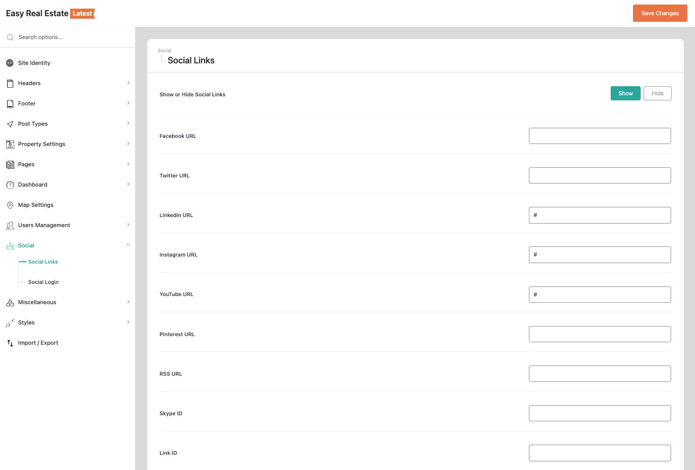
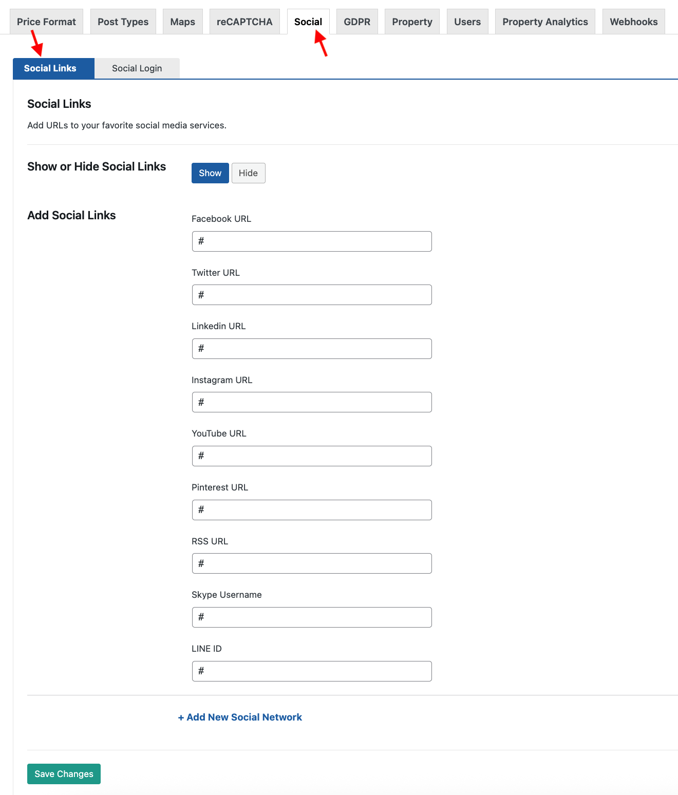
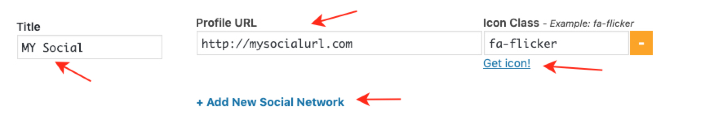

# Social Icons Settings

The **Social** settings allow you to manage and display social media links for your website, providing an easy way for visitors to connect with you across different platforms.

To access and configure these settings, follow the navigation path based on your version of the **RealHomes** theme:

=== "v4.5.1 and Later"

    !!! success "RealHomes Settings"
        Dashboard ➤ RealHomes ➤ Settings ➤ Miscellaneous ➤ Social (tab)

    

=== "v4.5.0 and Earlier"

    !!! info "Legacy Settings"
        Dashboard ➤ Easy Real Estate ➤ Settings ➤ Social (tab)

    

### **Managing Social Icons**

Once you have navigated to the **Social** section, you can:
- **Enable/Disable** social icons globally using the toggle.
- **Add New Social Icons** by clicking the **Add New** button.
- **Order** the icons by dragging and dropping them into your preferred sequence.

---

!!! info "Legacy Versions (Older than 3.9.0)"
    If you are using a version of RealHomes older than **3.9.0**, the settings can be found at:  
    **Dashboard** → **RealHomes** → **Customize Settings** → **Social Links**