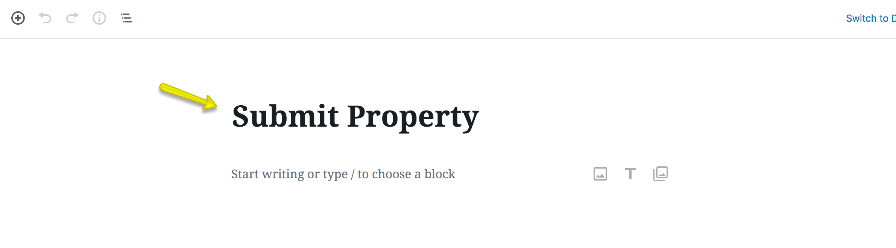
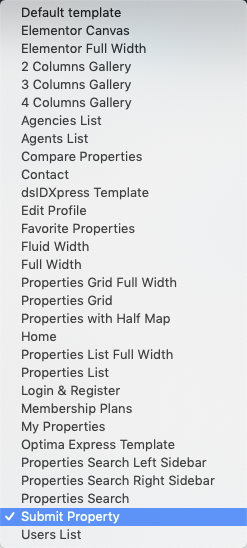
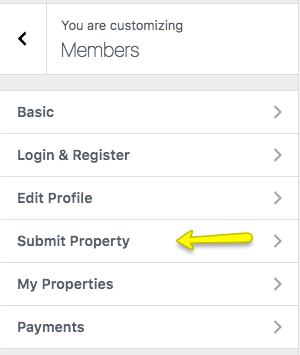
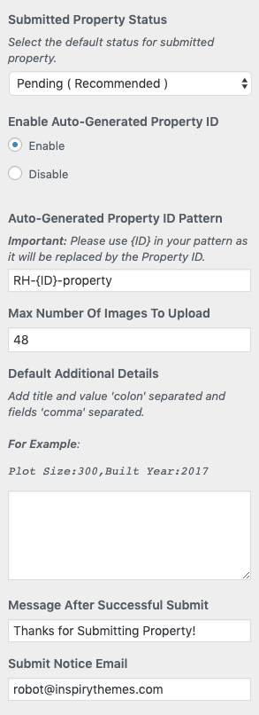

# Setup Submit Property Page

## Create Submit Property Page

!!! note
    If you have imported demo contents then **Submit Property** page is already created. But you still need to configure related settings as guided below.

To add **Submit Property** page, Go to **Dashboard → Pages → Add New**

Provide the page title 

Select the **Submit Property** template from page attributes.

### **Banner And Spacing Settings**

**Classic**

**Modern**

Publish the page once it is ready. 

Now you need to navigate to **Dashboard → Real Homes → Customize Settings → Members** and look for **Submit Property** section where you can configure related settings.

 

## **Submit Property Settings**

In order to change the settings for new properties submitted by the user you can navigate to **Dashboard → Real Homes → Customize Settings → Members → Submit Property** where you can change the settings accordingly.

 

### **Terms & Conditions**

You can add **Terms & Conditions** field to submit property page. You can also select a page for *Terms & Conditions*.

### **Choose Submit Property Status (Pending or Publish)**

You can change the status of the newly submitted property. You can either select **Pending** or **Publish**. If you will select Pending the property will not directly available for public view but if you select Publish then it will be published for everyone to see.

### **Auto-Generated Property ID**

You can enable/disable **Auto-Generated Property ID** for your properties, if you will activate the **Auto-Generated Property ID** then you will not be able to edit the **Property ID** anymore. You can also provide a pattern of your choice for the **Property ID** field.

### **Default Additional Details**

You can add default titles and values for additional property details using **Default Additional Details**.

### **Notice on Successful Property Submission**

The message which is shown after successful submission of the property can also be changed in this section.

### **Email For Notification of New Property Submissions**

The email address where you want to get the notification of new property listing submissions are also changed here.

### **Default Address & Map Location in Submit Form**

You can change the **Default Address** which is shown in **Submit Property** page from **Maps** Settings (**Easy Real Estate → Settings → Maps**). 

You can also modify the longitude and latitude of the default map location. Please make sure that you add the coordinates properly, adding bad coordinates will result in the issues accessing the Submit Property or Add New Property page.

Save the changes and your **Submit Property** page is ready for use. 

**Classic**

**Modern**

### **Individual Property Payments Settings**

If you like to charge the user/member of your website to list their properties for a cost then you can activate Individual Property Payments feature using either [**PayPal**](/paypal-ipn/) or [**Stripe**](/inspiry-stripe-payments/) or even both. Please visit the **Individual Property Payments** section to learn how.