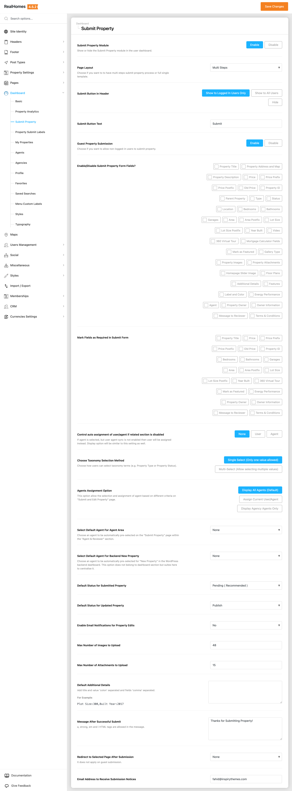
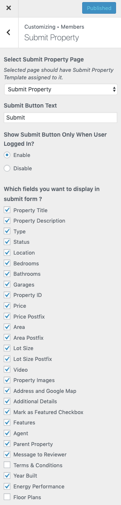

# 🏠 Submit Property – Customizer Settings

This section allows you to control the visibility, layout, fields, and behavior of the "Submit Property" functionality in the frontend dashboard. The settings can be found at:

=== "v4.5.1 and Later"

    !!! success "RealHomes Settings"
        Dashboard ➤ RealHomes ➤ Settings ➤ Dashboard ➤ Property Submit

    

=== "v4.5.0 and Earlier"

    !!! info "Legacy Settings"
        Dashboard ➤ RealHomes ➤ Customize Settings ➤ Dashboard ➤ Submit Property

    

---

## ✅ Submit Property Module

- **Enable / Disable**
  - Toggle the entire "Submit Property" module on or off for frontend users.

---

## 🧾 Page Layout

- **Single Step / Multi Step**
  - Choose whether the property submission form appears on a single page or is split into multiple steps.

---

## 🔳 Submit Button in Header

- **Show to Logged-in Users Only**
- **Show to All Users**
- **Hide**

Control the visibility of the "Submit Property" button in the site’s header.

---

## 📝 Submit Button Text

- Customize the text label on the submit button. (Default: `Submit`)

---

## 👤 Guest Property Submission

- **Enable / Disable**
  - Allow or restrict non-logged-in users from submitting properties.

---

## 🧩 Enable/Disable Submit Property Form Fields

Toggle the display of specific fields in the property submission form:

- Property Title
- Property Address and Map
- Property Description
- Price
- Old Price
- Price Prefix
- Price Postfix
- Type
- Status
- Bedrooms
- Bathrooms
- Garages
- Area
- Area Postfix
- Lot Size
- Lot Size Postfix
- Video
- 360 Virtual Tour
- Mortgage Calculator Fields
- Mark as Featured
- Gallery Images
- Property Attachments
- Property Slider Image
- Floor Plans
- Additional Details
- Labels and Color
- Energy Performance
- Owner Information
- Message to Reviewer
- Terms & Conditions

---

## 🧩 Mark Submit Property Form Fields as Required

Choose which fields appear in the property submission form and mark them as **required** as needed:

- Property Title
- Price
- Price Prefix
- Price Postfix
- Old Price
- Property ID
- Bedrooms
- Bathrooms
- Garages
- Area
- Area Postfix
- Lot Size
- Lot Size Postfix
- Year Built
- 360 Virtual Tour
- Mark as Featured
- Energy Performance
- Owner Information
- Message to Reviewer
- Terms & Conditions

---

## 👥 Agents Assignment Option

Choose how agent(s) are assigned when submitting a property:

- **Display All Agents (Default)**
- **Assign Current (Logged-in) Agent/User**
- **Display Agency's Agents Only**

---

## 🧑‍💼 Select Default Agent for Agent Area

- Pre-select an agent for the "Agent & Reviewer" section on the submit form.

---

## 🧑‍💼 Select Default Agent for Backend New Property

- Assign a default agent when adding properties from the WordPress backend if no agent is selected.

---

## 📃 Terms & Conditions Note

- Add a note to explain the Terms & Conditions field.
- Example: *Please agree to the privacy policy and terms before submitting your property.*

---

## 📄 Accept Terms & Conditions Before Property Submission

- Select a page to be linked as the Terms & Conditions document.
- Enforces user agreement before submitting.

---

## 📌 Default Status for Submitted Property

- **Pending (Recommended)**
- **Publish**

Choose whether newly submitted properties are published immediately or held for review.

---

## 🔁 Default Status for Updated Property

- **Pending**
- **Publish**

Determine the default status of a property after it has been edited by a user.

---

## 📧 Enable Email Notifications for Property Edits

- **Yes / No**

Notify admin when a submitted property is edited by its owner.

---

## 🖼️ Max Number of Images to Upload

- Limit the number of gallery images a user can upload.
- Example: `48`

---

## 📎 Max Number of Attachments to Upload

- Limit the number of document attachments.
- Example: `15`

---

## ➕ Default Additional Details

- Add predefined additional fields shown in the form.
- Example: `Plot Size:30,Built Year:2017`

---

## ✅ Message After Successful Submit

- Customize the success message shown to the user after submitting a property.
- Example: `Thanks for Submitting Property!`

---

## 🔄 Redirect to Selected Page After Submission

- Choose a page to redirect users after a successful property submission.

---

## 📥 Email Address to Receive Submission Notices

- Provide email(s) that should receive new submission notifications.
- Example: `robots@inspirythemes.com`