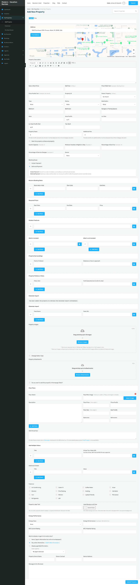
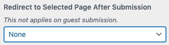

# Submit Property

### Submit Property Module
 
You can Enable/Disable **Submit Property** module on dashboard by navigating to **Dashboard → RealHomes → Customize Settings → Dashboard → Submit Property** section.

**Modern**

**Classic**

Frontend view of submit/add property module.

### Submit Property Form Layout

### Submit Property Form Fields

### **Terms & Conditions**

You can add **Terms & Conditions** field to submit property module. You can also select a page for *Terms & Conditions*.

### **Choose Submit Property Status (Pending or Publish)**

You can change the status of the newly submitted property. You can either select **Pending** or **Publish**. If you will select Pending the property will not directly available for public view but if you select Publish then it will be published for everyone to see.

### **Choose Updated Property Status (Pending or Publish)**

You can change the default status of updated property using this setting.

### **Auto-Generated Property ID**

You can enable/disable **Auto-Generated Property ID** for your properties, if you will activate the **Auto-Generated Property ID** then you will not be able to edit the **Property ID** anymore.

You can also provide a pattern of your choice for the **Property ID** field.

### **Default Additional Details**

You can add default titles and values for additional property details using **Default Additional Details**.

### **Notice on Successful Property Submission**

The message which is shown after successful submission of the property can also be changed in this section.

### **Email For Notification of New Property Submissions**

The email address where you want to get the notification of new property listing submissions are also changed here.

### **Redirect Users After Successful Property Submission**

We have also added an option that can help you setup a page for redirection after successful property submission.

### **Default Address & Map Location in Submit Form**

You can change the **Default Address** which is shown in **Submit Property** module from **Maps** Settings (**Easy Real Estate → Settings → Maps**). 

You can also modify the longitude and latitude of the default map location. Please make sure that you add the coordinates properly, adding bad coordinates will result in the issues accessing the Submit Property or Add New Property module.

### **Individual Property Payments Settings**

If you like to charge the user/member of your website to list their properties for a cost then you can activate Individual Property Payments feature using either [**PayPal**](https://realhomes.io/documentation/realhomes-paypal-payments/), [**Stripe**](https://realhomes.io/documentation/inspiry-stripe-payments/) and [**WooCommerce**](https://realhomes.io/documentation/realhomes-woocommerce-payment-setup/).

Please visit the **Individual Property Payments** section to learn how.