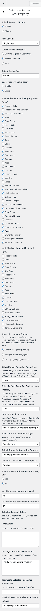

# Setup Submit Property Page

## Create Submit Property Page
> Note: If you have imported demo contents then Submit Property page is already created. But you still need to configure related settings as guided below.

To add Submit Property page, Go to **Dashboard → Pages → Add New**

Provide the page title 

Select the **Submit Property** template from page attributes.

Publish the page once it is ready. 

Now you need to navigate to **Dashboard → Real Homes → Customize Settings → Members** and look for **Submit Property** section where you can configure related settings.

 

### Few Important Points to Note

 

1. You can change the status of the newly submitted property. You can either select **Pending** or **Publish**. If you will select Pending the property will not directly available for public view but if you select Publish then it will be published for everyone to see.

2. You can add **Terms & Conditions** field to submit property page. You can also select a page for *Terms & Conditions*.

3. You can change the **Default Address** which is shown in **Submit Property** page.

4. You can also modify the longitude and latitude of the default map location.

5. You can enable **Auto-Generated Property ID** for your properties. You can also provide a pattern for the property id field.

6. You can add default titles and values for addition property details using **Default Additional Details**.

7. The message which is shown after successful submission of the property can also be changed in this section.

8. The email address where you want to get the notification of new property listing submissions are also changed here.

Save the changes and your **Submit Property** page is ready for use. 

**Classic**

**Modern**

