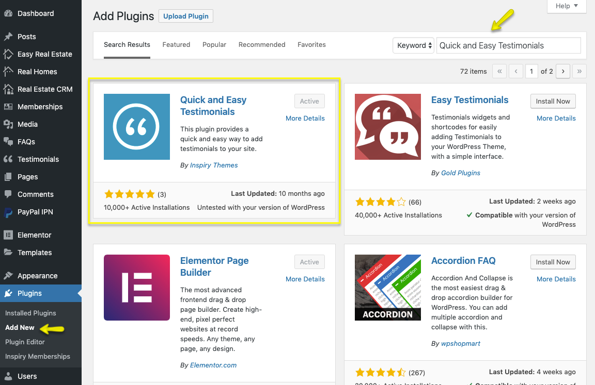

How to set up Testimonials Page

I have developed [Quick and Easy Testimonials plugin](https://wordpress.org/plugins/quick-and-easy-testimonials/) for this purpose.

Install the [Quick and Easy Testimonials plugin](https://wordpress.org/plugins/quick-and-easy-testimonials/). As guided in screenshot below.

After installing and activating the plugin. You can add testimonials as displayed in screenshot below. 

Later on you can use following shortcodes to display testimonials on a page.

- Display all testimonials.
	
	**Shortcode** `[testimonials]`

- Display specific number of testimonials.
	
	**Shortcode** `[testimonials count="3"]`

- Display only testimonials related to a category.
	
	**Shortcode** `[testimonials filter="category-slug"]`

- Display single testimonial.
	
	**Shortcode** `[testimonials id="123"]`
