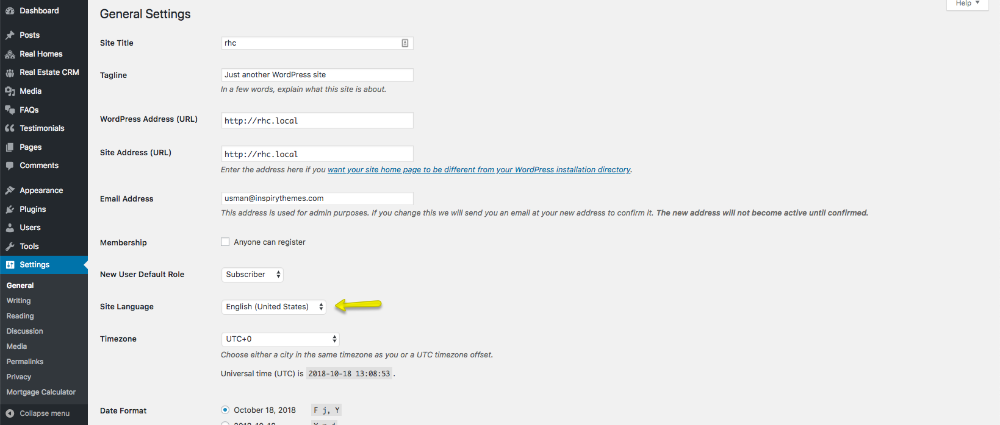

# **Translation**

### **Language Packs**

RealHomes Theme come with multiple human as well as machine translated languages which are listed below.

#### **Human Translated Languages**

- Spanish
- French
- Italian
- German
- Portuguese
- Turkish

#### **Machine Translated Languages**

There are lots of machine translated language packs available and we have created a separate repository so anyone can contribute to it. The respository can be found here: https://github.com/InspiryThemes/realhomes-translations (feel free to contribute if you can).

> Please note that machine translations are partial which means only a limited number of strings are translated in the machine-translated files in the repository. So, the rest must be translated manually using Loco Translate plugin.

### **How to apply the available Language Packs**

The Human Translated languages are already included in the main theme so applying them is very easy. Simply navigate to **Dashboard → Settings → General** and select any of the 6 available human translated languages from **Site Language** drop down.

To apply a Machine Translation language pack, you simply have to download the language pack from the repository at github and upload both .po and .mo file to **wp-content → themes → realhomes → languages** directory. After uploading simply change the **Site Language** in **Dashboard → Settings → General**

### **Translating RealHomes Theme**

**RealHomes Theme** is fully translation ready.

To translate it in one language, please consult the Knowledge Base article on [How to translate your theme to your language](https://support.inspirythemes.com/knowledgebase/how-to-translate-your-theme-to-your-language/)

**OR**

You can also use [Loco Translate Plugin](https://wordpress.org/plugins/loco-translate/) by Tim Whitlock to translate this theme in one language.