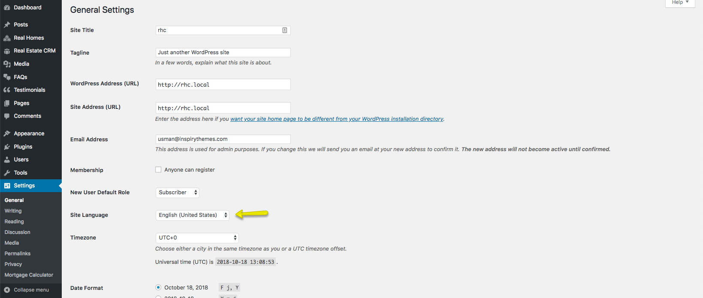

# **Translation**

### **Language Packs**

Real Homes Theme come with multiple human as well as machine translated languages which are listed below.

#### **Human Translated Languages**

- Spanish
- French
- Italian
- German
- Portuguese
- Turkish

#### **Machine Translated Languages**

There are lots of machine translated language packs available and we have made a separate repository so if anyone wants to contribute to it they can do it. The respository can be accesses here: https://github.com/InspiryThemes/realhomes-translations (feel free to contribute if you can).

### **How to apply the available Language Packs**

The human translated languages are already included in the main theme so applying them is very easy. Simply navigate to **Dashboard → Settings → General** and select any of the 6 available human translated languages from **Site Language** drop down.

### **Translating Real Homes Theme**

**Real Homes Theme** is fully translation ready.

To translate it to one language then please visit [This Knowledge Base Article](https://support.inspirythemes.com/knowledgebase/how-to-translate-your-theme-to-your-language/)

**OR**

You can also use [Loco Translate Plugin](https://wordpress.org/plugins/loco-translate/) by Tim Whitlockto translate this theme to your language or single language.

If you are planning to translate your website into multiple languages then [WPML Multilingual Plugin](https://wpml.org) is the best option out there.