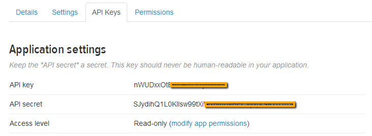
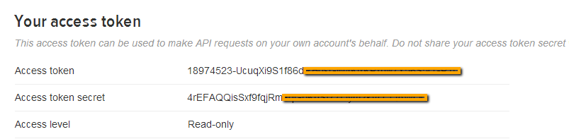
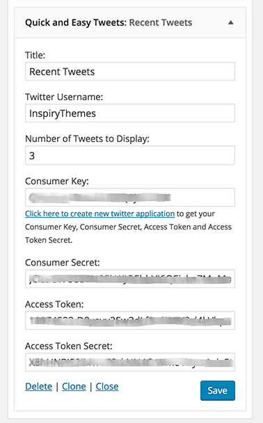

# How to set up Twitter Widget

Latest tweets widget uses [Quick and Easy Tweets](https://wordpress.org/plugins/quick-and-easy-tweets/) plugin.

- Install and activate the [Quick and Easy Tweets](https://wordpress.org/plugins/quick-and-easy-tweets/) plugin.

- Now, you need the twitter App's consumer key, consumer secret, access token and access token secret for twitter authentication. 

- To get all these keys, you need to register a new twitter app from following url 

- After registering app and generating access token you will have api keys and access token as displayed below 

- API Key is basically consumer key and API secret is consumer secret. 

- After installing and activating the plugin, Go to **Dashboard → Appearance → Widgets** and look for Quick and Easy Tweets widget. Use it in sidebar or footer widget area and provide requested information. 

