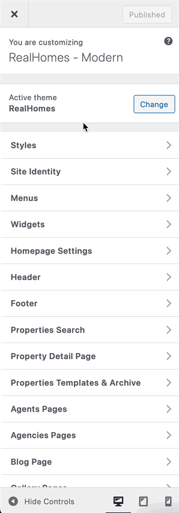

# How to Modify Typography in RealHomes

You can modify the Typography settings in RealHomes by navigating to **Dashboard → RealHomes → Customize Settings → Styles → Typography** and select the fonts as per your choice.

