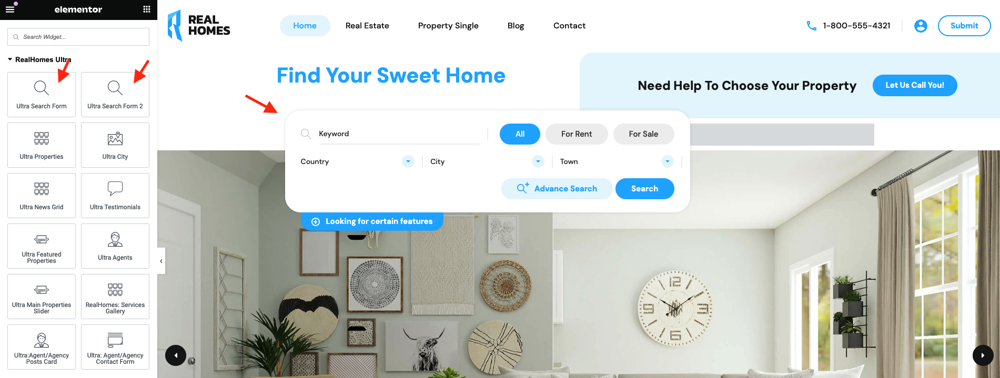
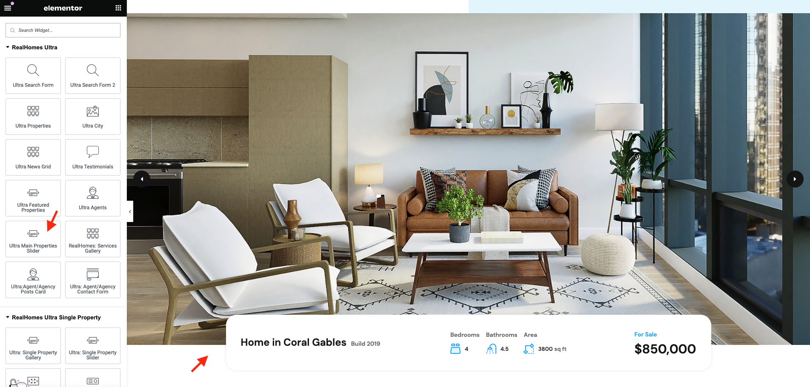
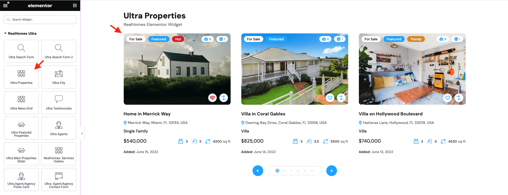
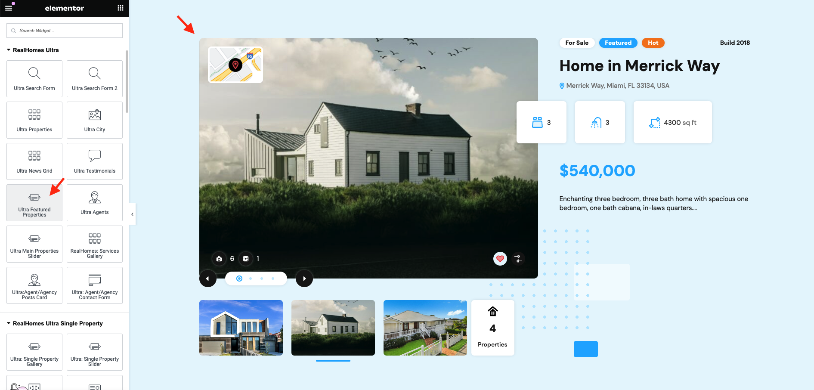
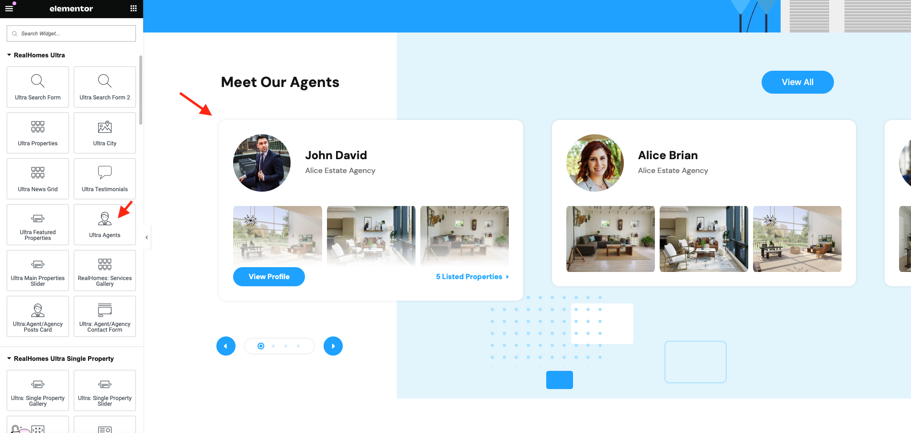
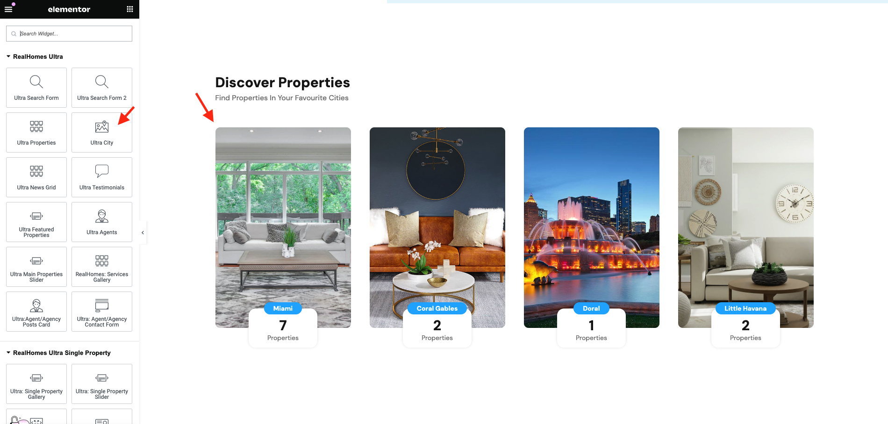
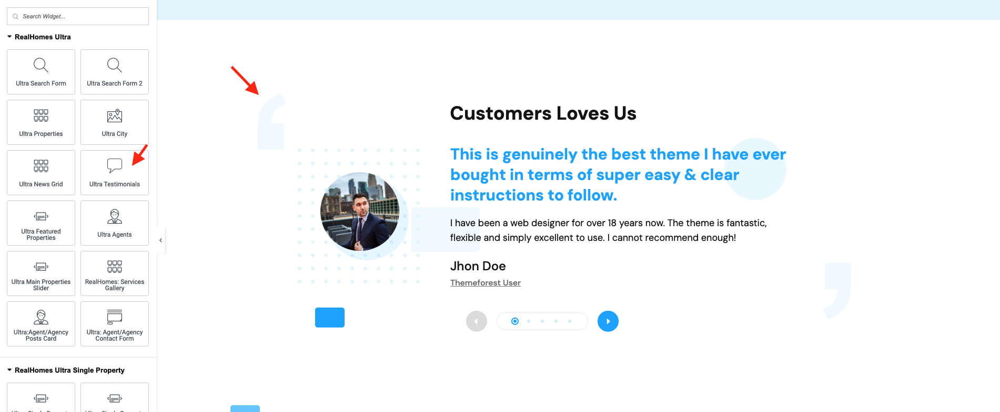
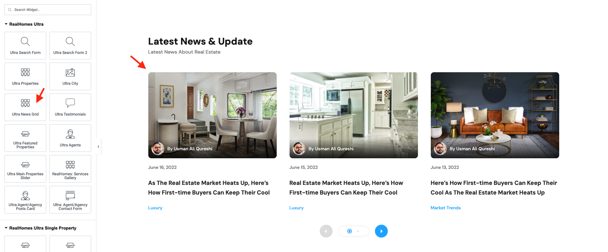

# RealHomes Ultra Elementor Widgets

First of all, to edit the page with Elementor by simple clicking on **Edit with Elementor** button. It will redirect you to the **Elementor's Editing Mode** where you will have **Elementor's Widget Panel** on left and **Page's Preview** on the right.

The page must have Full Width or Fluid Width Page Template assigned.

### **Container Settings**

The very first step is to set a full width container with no gaps. Please check out the following video.

<iframe width="688" height="387" src="https://www.youtube.com/embed/BWpxOLYdGJU" frameborder="0" allow="accelerometer; autoplay; encrypted-media; gyroscope; picture-in-picture" allowfullscreen></iframe>

To add any RealHomes Widget simply drag the widget to the right as shown in the following videos (**double click** to **video** for **full screen** mode).

### **Ultra Search Form**

The RealHomes **Ultra Search Form** elementor widget is the advanced search form, which you can place anywhere throughout the website.

### **Ultra Main Properties Slider**

The RealHomes **Ultra Main Properties Slider** elementor widget can be used to have a hero properties slider on the home page.

### **Ultra Properties**

The RealHomes **Ultra Properties** elementor widget allows you to display properties in multiple variations.

### **Ultra Featured Properties**

The RealHomes **Ultra Featured Properties** elementor widget enabled you to show only **Featured** properties.

### **Ultra Agents**

If you like to display the agents, then you can place the RealHomes **Ultra Agents** on any page.

### **Ultra City**

The RealHomes **Ultra City** elementor widget lets you display taxonomies in a very nice manner.

### **Ultra Testimonials**

The RealHomes **Ultra Testimonials** elementor widget can help you display good words of your clients.

### **Ultra News Grid**

The RealHomes **Ultra News Grid** elementor widget can be used to put the blog posts on any page.

