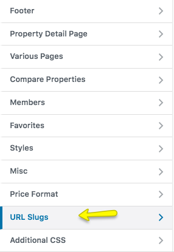

# URL Slugs Settings

To change **URL Slugs** for property or agent or various taxonomies please navigate to **Dashboard → Appearance → Customize** and look for **URL Slugs** panel for related settings. As demonstrated in the screenshots.

