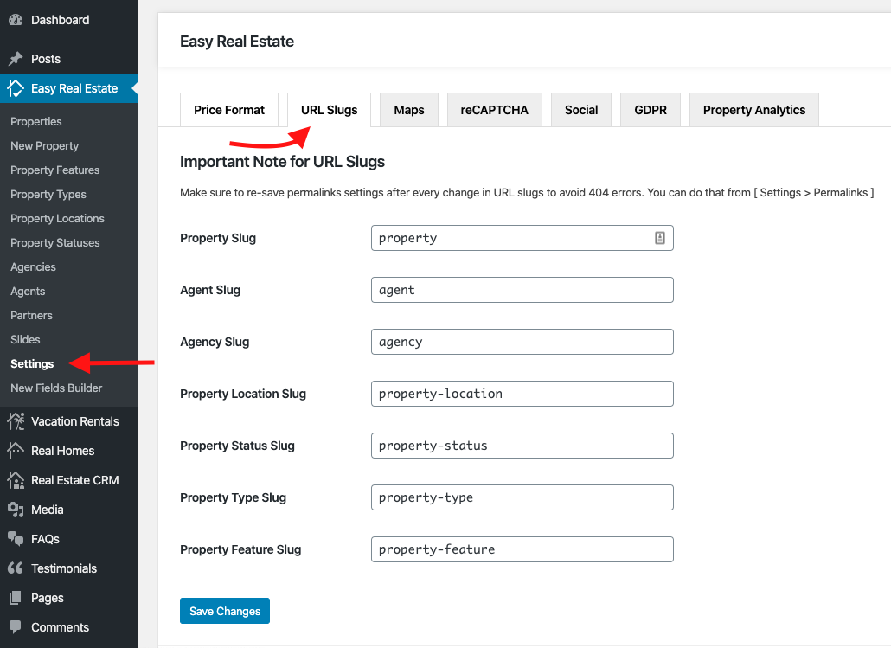

# URL Slugs Settings

You can change the **URL Slugs** for property, agent or various taxonomies in **Easy Real Estate → Settings → URL Slugs**.

Save the changes and ensure to re-save **Permalinks** settings from **Dashboard → Settings → Permalinks** to avoid unwanted issues.

!!! info "Important Information"
    If you are running the RealHomes Theme older than {==3.9.0==} version then related settings can be found by navigating to **Dashboard → RealHomes → Customize Settings → URL Slugs**