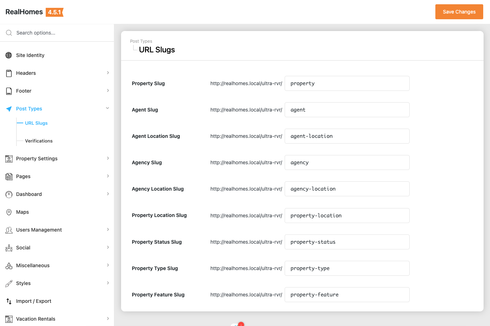
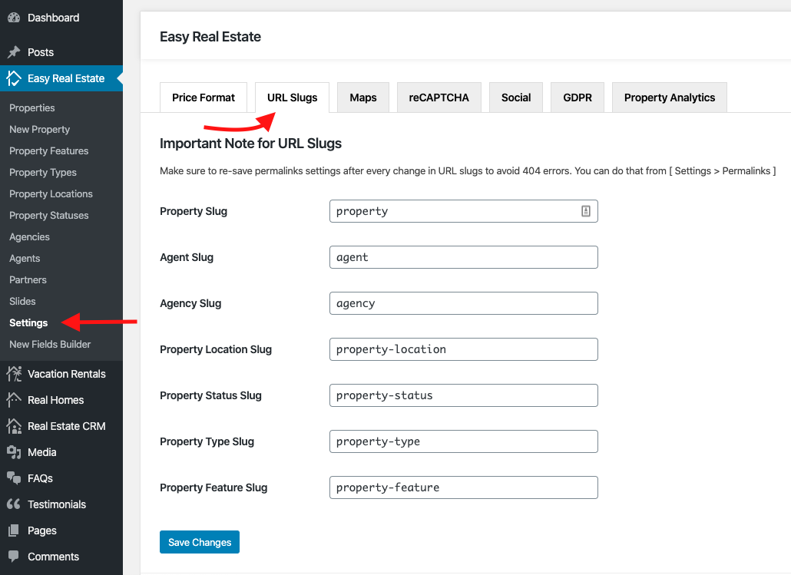

# URL Slugs Settings

The **URL Slugs** settings within the **Easy Real Estate** plugin provide full control over the URL structure for your properties, agents, agencies, and various taxonomies (locations, statuses, types, and features).

To access and configure these settings, follow the navigation path based on your version of the **RealHomes** theme:

---

### **v4.5.1 and Later**

!!! info "Navigation Path"
    **Dashboard** → **RealHomes** → **Settings** → **Post Types** (tab) → **URL Slugs** (sub-tab)

---

### **v4.5.0 and Earlier**

!!! info "Navigation Path"
    **Dashboard** → **Easy Real Estate** → **Settings** → **Post Types** (tab) → **URL Slugs** (tab)

---

### **Customizable Slugs Overview**

Once you have navigated to the **URL Slugs** section, you can customize the following slugs:

*   **Properties:** `Property Slug`
*   **Agents:** `Agent Slug`, `Agent Location Slug`
*   **Agencies:** `Agency Slug`, `Agency Location Slug`
*   **Taxonomies:** `Property Location Slug`, `Property Status Slug`, `Property Type Slug`, `Property Feature Slug`

Update the values to your preferred slugs and click **Save Changes** at the bottom of the page.

---

### **Crucial Step: Re-save Permalinks**
Whenever you modify URL slugs, it is **essential** to refresh your site's permalinks to ensure the new structures are recognized and to prevent `404 Not Found` errors.

1.  Navigate to **Dashboard → Settings → Permalinks**.
2.  Scroll down and click the **Save Changes** button (no modifications needed on this page).