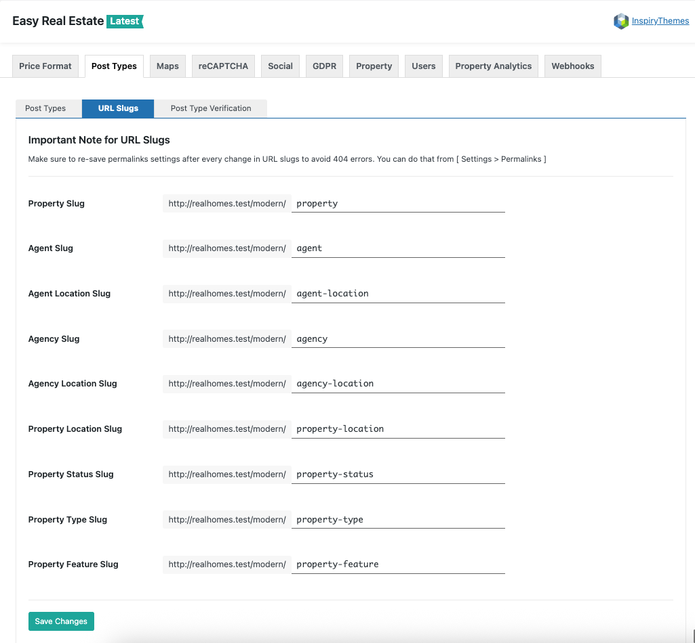

# URL Slugs Settings

To change **URL Slugs** for property or agent or various taxonomies please navigate to **Easy Real Estate → Settings → URL Slugs** for related settings. As demonstrated in the screenshots below.

Save the changes and Make sure to re-save pretty permalinks from **Dashboard → Settings → Permalinks**. Otherwise your changes might create errors on front end. 
