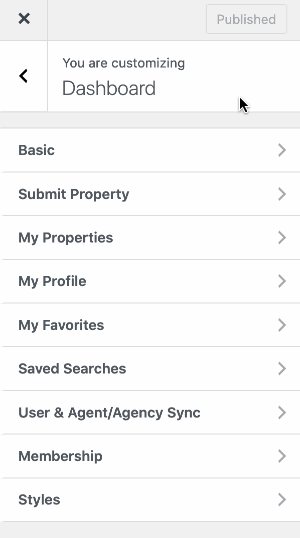

# User and Agent/Agency Synchronization

!!! info "Important"

    You must setup and activate User Registration for this feature to work properly.

The User and Agent / Agency Synchronization provides the feature that synchronizes the information of a user with the Agent or Agency post type.

It can be enabled in **Customizer** settings [ **Dashboard → RealHomes → Customize Settings → Dashboard → User & Agent/Agency Sync** ] section.

After enabling it, the system will automatically create the new Agent / Agency for newly registered user. The related Agent / Agency information will also be updated when the user updates his / her information in the profile.

It will work vice versa for users when new agent or agency will be added or updated.

