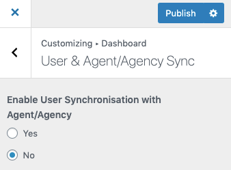

# User and Agent/Agency Synchronization

Synchronization between WordPress Users and Real Estate Agent/Agency can be enabled by navigating to the **User & Agent/Agency Sync** section under the same **Members** panel. After enabling it, the system will automatically add a new agent/agency for a newly registered user and related agent/agency information will be updated with an update in user information. It will work vice versa for users when new agent or agency will be added or updated.

