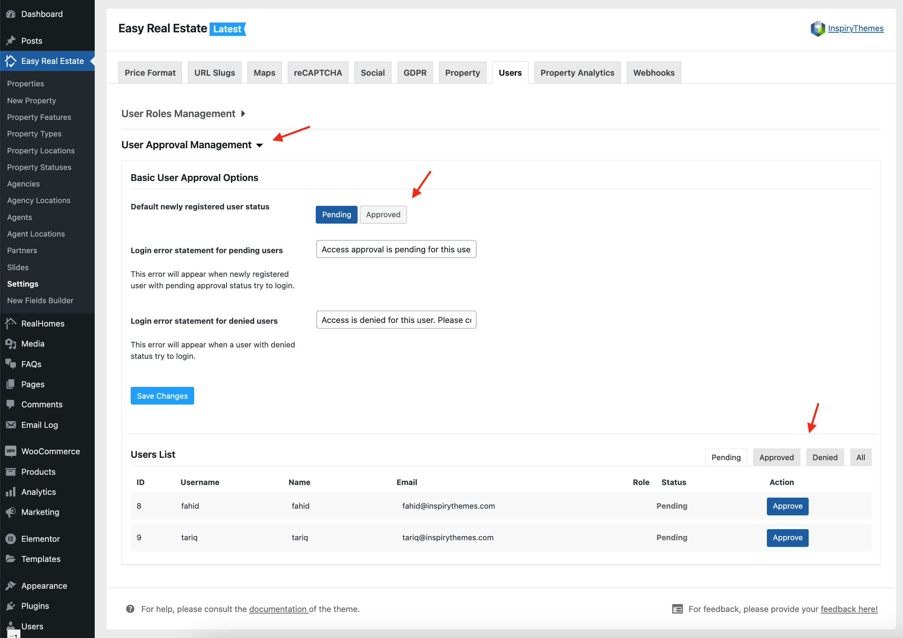

# User Approval Management

The **User Approval Management** feature in RealHomes gives you full control over user registrations by allowing you to review, approve, or deny users before they can access your website. This feature is essential for maintaining security and ensuring only approved users can interact with your platform.

To access this feature, go to **Dashboard → Easy Real Estate → Settings → Users → User Approval Management**.

### **Key Features**

#### **1. Default User Status**
When a new user registers, you can set their default status to either:
- **Pending**: The user will not be able to log in until an admin reviews and approves their registration.
- **Approved**: The user will automatically gain access to the site without admin intervention.

By default, it's recommended to set users to **Pending**, so that you have full control over who gains access to your website.

#### **2. Custom Login Error Messages**
You can define custom error messages for users based on their approval status:

- **Pending Users**: A custom message can be shown when users with a pending status try to log in. Example: “Access approval is pending for this user.”
  
- **Denied Users**: A different custom message can be shown for users whose registrations were denied. Example: “Access is denied for this user. Please contact support for more information.”

This ensures that users are informed of their registration status and can take appropriate action.

#### **3. User List and Approval Management**
The **User Approval Management** section provides a detailed list of all users who have registered on your site. The list includes the following columns:

- **ID**: A unique identifier for each user.

- **Username**: The username chosen by the user during registration.

- **Name**: The full name of the user.

- **Email**: The user’s email address.

- **Role**: The assigned role for the user (e.g., Agent, Buyer, etc.).

- **Status**: Displays the current approval status, such as `Pending`, `Approved`, or `Denied`.

#### **4. Managing User Status**
From the user list, you can quickly take action on each user:
- **Approve**: Click the `Approve` button next to a user’s name to grant them access to the site.
- **Deny**: If necessary, click the `Deny` button to reject the user's registration, preventing them from logging in.

#### **5. Status Filters**
To help you efficiently manage user registrations, you can filter users by their status using the following tabs at the top of the list:

- **Pending**: Shows users whose registrations are awaiting approval.

- **Approved**: Displays users who have been approved and granted access.

- **Denied**: Lists users who have been denied access.

- **All**: Shows all users, regardless of their approval status.

By using these filters, you can easily manage large numbers of registrations and take quick actions on users based on their status.

This user approval system enhances security, giving you full control over who can register and interact with your website. By setting clear approval workflows, you can protect your platform and ensure that only legitimate users gain access.