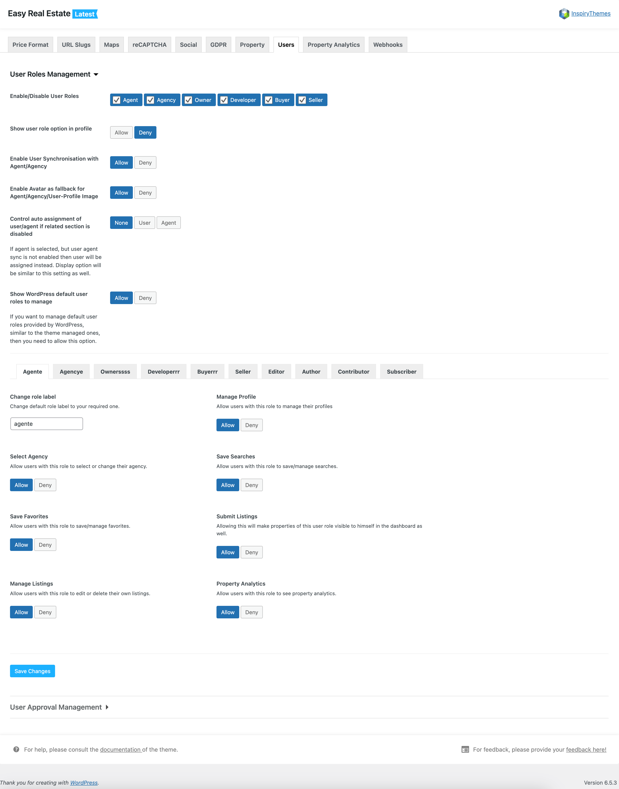

# User Roles Management

!!! info "Important"

    For this feature to function correctly, it is essential to set up and activate User Registration.

### **User, Agent, Agency Synchronization**

The User Roles and Agent/Agency Synchronization feature synchronizes user information with the Agent or Agency post type, offering a range of user roles to select from.

To enable this feature, navigate to the **Easy Real Estate** settings [ **Dashboard → Easy Real Estate → Settings → Users → User Role Management** ] section.

Once activated, the system will automatically generate a new Agent/Agency profile for newly registered users. Any updates made to the user's profile information will be reflected in the associated Agent/Agency details.

