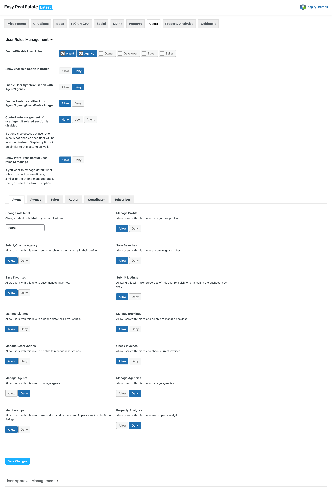
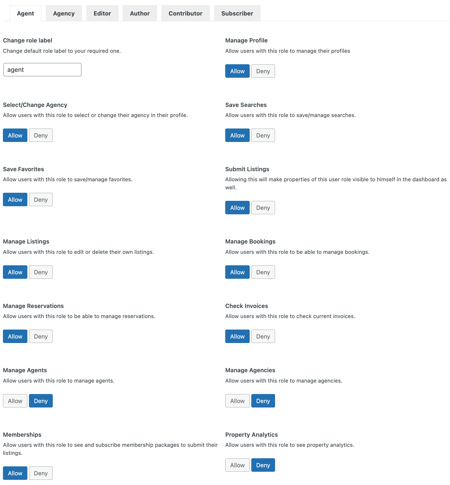

# User Roles Management

!!! info "Important"

    Ensure **User Registration** is set up and activated for this feature to function properly.

### **User, Agent, Agency Synchronization**

The **User Roles** feature allows seamless synchronization between user profiles and their respective Agent or Agency profiles, providing a range of roles including Agent, Agency, Owner, Developer, Buyer, and Seller.

To enable this feature, go to **Dashboard → Easy Real Estate → Settings → Users → User Role Management**.

Once enabled, the system will automatically create a new Agent or Agency profile for each newly registered user, depending on their selected role. Any profile updates by the user will be synchronized with the associated Agent or Agency details.

**Available options:** 

**Enable User Synchronization:** Easily toggle user synchronization with Agent/Agency profiles to streamline profile updates.

**Avatar Fallback:** If user profile images are not available, avatars can automatically fall back to Agent/Agency profile images for a unified visual experience.

**Control Auto-Assignment:** Allows admins to prevent auto-assignment of users to Agent roles if the synchronization feature is disabled.

**Enable/Disable Specific Roles:** Choose which roles (e.g., Agent, Agency, Owner, Buyer, Developer, Seller) to enable or disable within your system.

This ensures that profile information remains consistent across all roles, making property and agency management more efficient.

---

### **User Role Access Management**

This feature gives you granular control over access permissions for various user roles within WordPress and RealHomes, such as Agent, Agency, Owner, Buyer, Seller, Developer, and more.

You can allow or deny access to specific functionalities for each user role by navigating to **Dashboard → Easy Real Estate → Settings → Users → User Role Management**.

Key access options include:

- **Manage Profile:** Enable/disable the ability to manage user profiles.

- **Select/Change Agency:** Control whether users can select or change their agency.

- **Manage Listings:** Allow/deny access to create, edit, or delete property listings.

- **Save/Manage Favorites:** Control the ability to save favorite properties.

- **Submit Listings:** Decide whether users can submit, edit, and delete property listings.

- **Manage Agents:** Allow management of agents.

- **Manage Agencies:** Allow users with this role to manage agencies.

- **Check Invoices:** Enable/disable access to check current invoices for users with specific roles.

- **Manage Reservations:** Control access to manage reservations.

- **Property Analytics:** Control access to property performance analytics.

This flexible access management system helps streamline roles and responsibilities, allowing you to tailor permissions according to each user's role.

