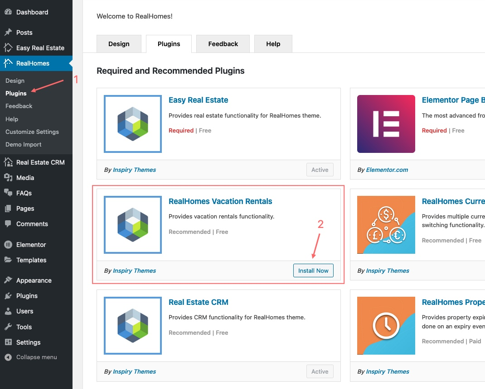
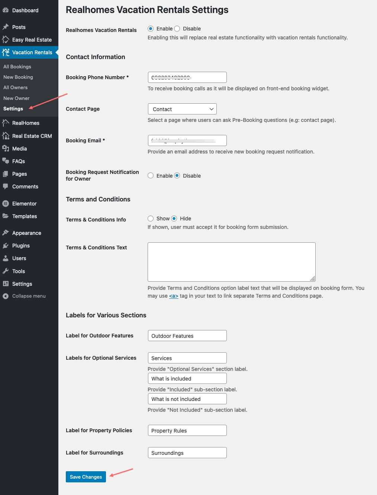
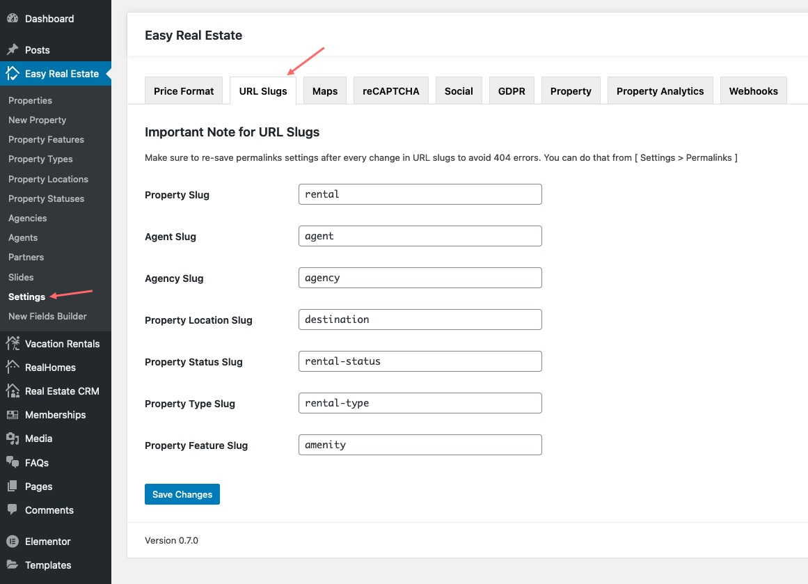
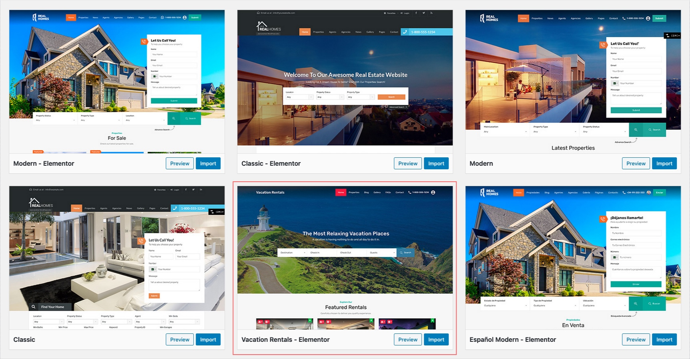

!!! info "About Vacation Rentals"

    Vacation Rentals functionality is introduced in RealHomes version {== **3.12.0** ==}. Make sure you have followed the [Installation](installation-and-activation.md) guide before following the steps given below .

!!! warning "Important"

    Activating Vacations Rental will disable some standard Real Estate features to fully provide you a full property rental portal experience.

### **Step 1. Install and Activate Vacation Rentals Plugin**
First you need to install **RealHomes Vacation Rentals** plugin. Navigate to the **Dashboard > RealHomes > Plugins** and Look for **RealHomes Vacation Rentals** plugin and click on *Install Now* button. After plugin installation click on the **Activate** button.

### **Step 2. Configure Vacation Rentals Plugin Settings**
To configure Vacation Rentals settings go to **Dashbaord > Vacation Rentals > Settings** page.

You can configure the following settings on this page.

- *Enable/Disable Vacation Rentals* - You can `Enable/Disable` the whole vacation rentals functionality.
- *Contact Information* - Set the booking `Phone Number*`, `Contact Page` for additional queries and `Booking Email*`.
- *Booking Notification for Owner* - By default booking notification emails go to the given booking email only. You can also enable the `Booking Notifications for the Property Owner`.
- *Terms and Conditions* - You can show/hide the `Terms & Conditions Option` and also set this option `Description`.
- *Property Sections Labels* - There are different property detail page sections related to the vacation rentals. Those sections labels can be set on this settings page.

### **Step 3. Configure URL Slugs in Easy Real Estate Settings**
To change **URL Slugs** for rentals and various taxonomies please navigate to **Easy Real Estate → Settings → URL Slugs** for related settings. As demonstrated in the screenshot below.

### **Step 4. Save Permalinks Settings**

Go to **Dashboard → Settings → Permalinks** and choose *Post name* from Common Settings and save the changes, As displayed in the following screenshot. It is important to save these settings to avoid 404 Errors after URL slug changes.

### **Step 5. Import Vacation Rentals Demo Data**

Now you can import the **Vacation Rentals Demo Contents**. Go to **Real Homes → Demo Import** to import demo data.

Click on blue **Import Demo** button of **Vacation Rentals - Elementor** and you will see the next page where it will confirm the required plugins are installed including the Vacation Rentals plugin.

If any plugin is missing then the Demo Import process will install it so click on **Continue & Import** button again to confirm the import.

Wait for few minutes as the demo images are being fetched (downloaded) from the remote server to your website, and this process can take a couple of minutes (depending on the speed of your hosting server).

!!! warning "Important"
    Sometimes, the import process takes longer than expected and doesn't complete in the first attempt. So, simply import again until the process is complete.

**Once the import process is complete**, You will receive a notice as the one displayed in the screen shot below.

Visit your site and you will find your site working like the theme demo.

For any assistance, Kindly register/login at our [support website](https://support.inspirythemes.com/login-register/) and [ask your question](https://support.inspirythemes.com/ask-question/) over there. So that our support team can assist you properly.