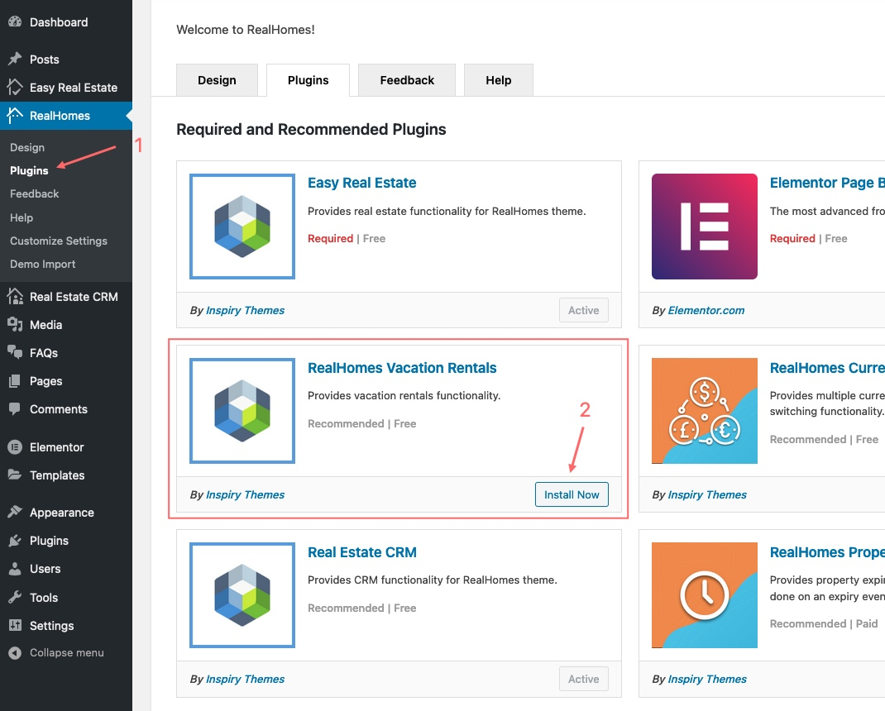
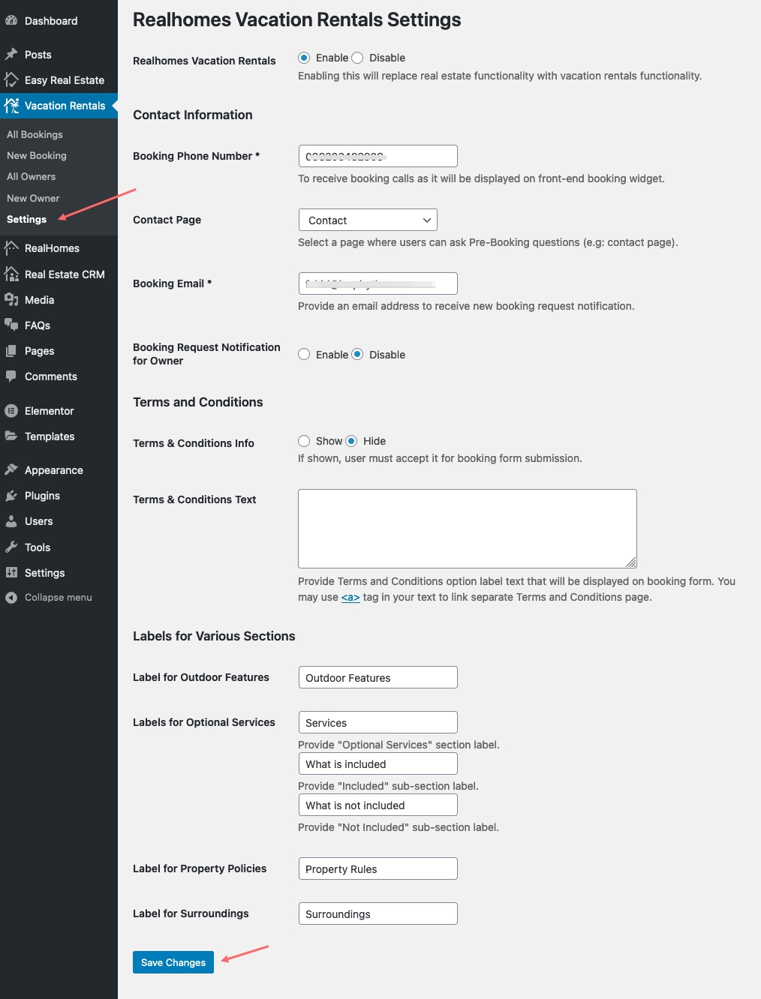
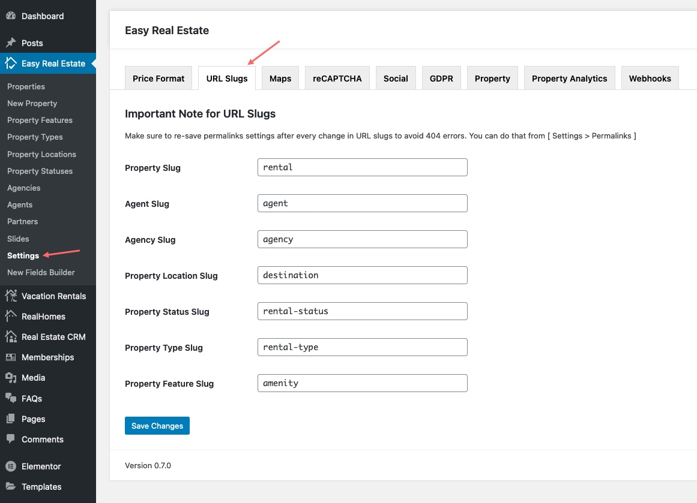
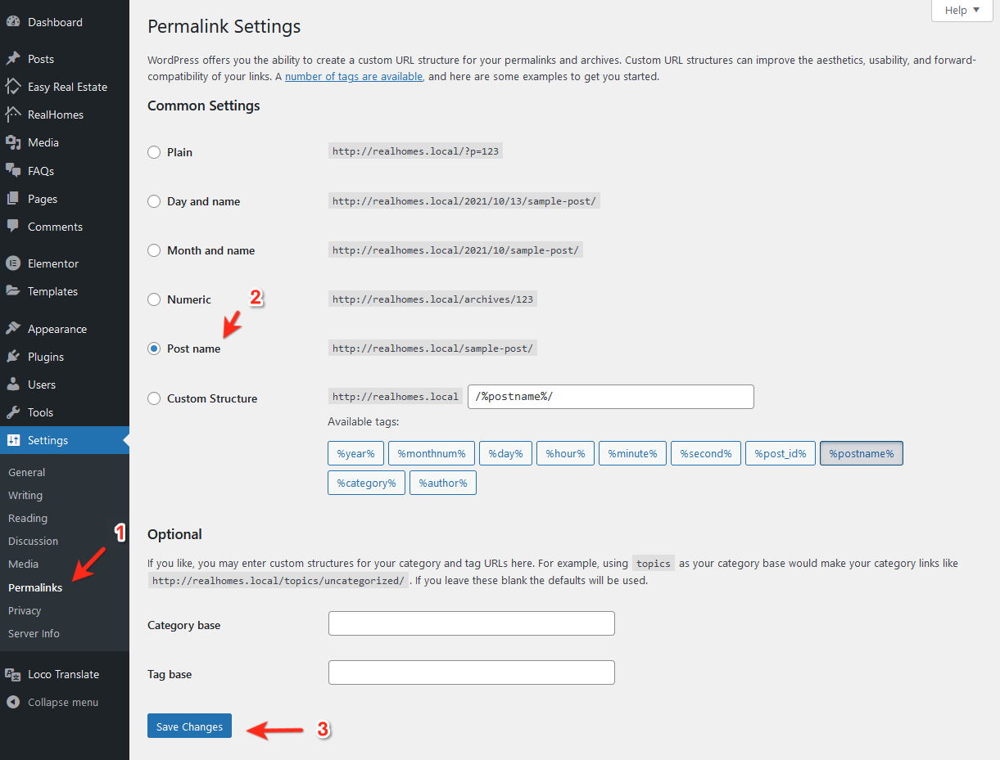
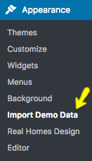
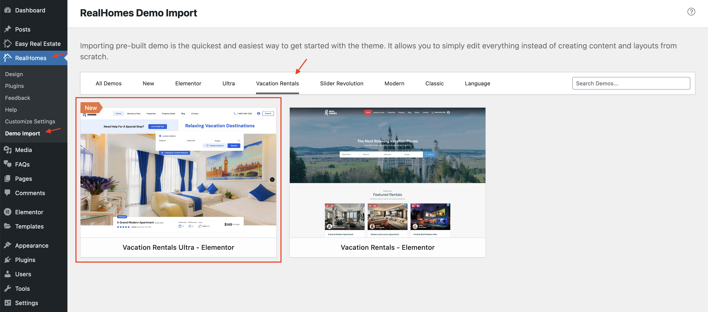

# Vacation Rentals Setup with Ultra Design

!!! info "About Vacation Rentals - Ultra"

    Vacation Rentals for Ultra design is added in RealHomes version {== **4.2.0** ==}. Make sure you have followed the [Installation](installation-and-activation.md) guide.

!!! warning "Important"

    Activating Vacations Rental will disable some standard Real Estate features to provide a full property rental portal experience.

### **Step 1. Install and Activate Vacation Rentals Plugin**
Navigate to **Dashboard → RealHomes → Plugins** and install **RealHomes Vacation Rentals**. After installation, click **Activate**.

### **Step 2. Configure Vacation Rentals Plugin Settings**
To configure Vacation Rentals settings, navigate based on your version:

=== "v4.5.1 and Later"

    !!! success "RealHomes Settings"
        Dashboard ➤ RealHomes ➤ Settings ➤ Vacation Rentals

    

=== "v4.5.0 and Earlier"

    !!! info "Legacy Settings"
        Dashboard ➤ Vacation Rentals ➤ Settings

    

You can configure the following:

- *Enable/Disable Vacation Rentals*
- *Contact Information* (Phone, Contact Page, Booking Email)
- *Booking Notification for Owner*
- *Terms and Conditions*
- *Property Sections Labels*

### **Step 3. Configure URL Slugs**
To change **URL Slugs**, navigate based on your version:

=== "v4.5.1 and Later"

    !!! success "RealHomes Settings"
        Dashboard ➤ RealHomes ➤ Settings ➤ URL Slugs

    

=== "v4.5.0 and Earlier"

    !!! info "Legacy Settings"
        Dashboard ➤ Easy Real Estate ➤ Settings ➤ URL Slugs

    

### **Step 4. Save Permalinks Settings**

Go to **Dashboard → Settings → Permalinks**, choose *Post name*, and save changes to avoid 404 Errors.

### **Step 5. Import Vacation Rentals Demo Data**

Go to **Dashboard → RealHomes → Demo Import** and click on the **Vacation Rentals** label to find related demos.

Click **Import Demo** for **Vacation Rentals - Elementor** and follow prompts.

!!! warning "Important"
    If the process doesn't complete, simply try again.

Visit your site to see it in action.

For assistance, please visit our [support website](https://support.inspirythemes.com/login-register/).