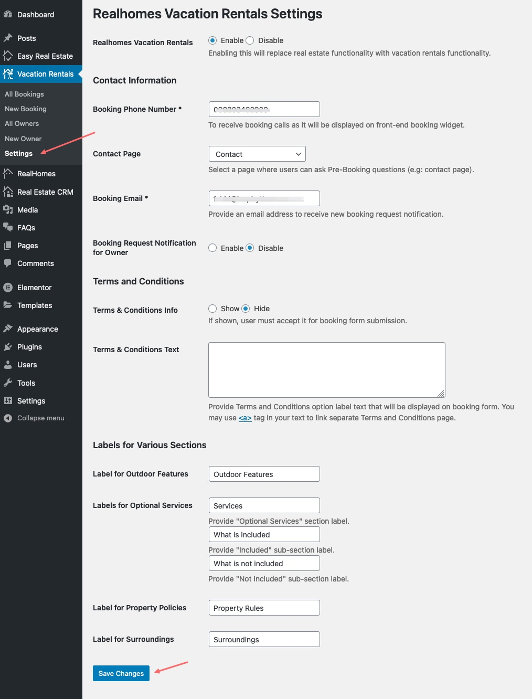

RealHomes Vacation Rentals booking system provides a complete rental solution from booking to reserved dates calendar and dedicated rental specific advance search with many more features.

!!! info "Important Information"

    Vacation Rentals booking system is introduced in RealHomes version {== **3.12.0** ==}. Before you start setting it up, ensure RealHomes theme `version 3.12.0` and all latest required plugins are installed and activated. To set it up please follow the guide given below.

### **Installation**
You would need to install **RealHomes Vacation Rentals** plugin. Go to the **Dashboard > RealHomes > Plugins** and click on the *Install Now* button of the *RealHomes Vacation Rentals* plugin card.

After plugin installation click on the *Activate* button.

### **Settings**
To configure Vacation Rentals settings go to **Dashbaord > Vacation Rentals > Settings** page.

You can configure the following settings on this page.

- *Enable/Disable Vacation Rentals* - You can `Enable/Disable` the whole vacation rentals functionality.
- *Contact Information* - Set the booking `Phone Number*`, `Contact Page` for additional queries and `Booking Email*`.
- *Booking Notification for Owner* - By default booking notification emails go to the given booking email only. You can also enable the `Booking Notifications for the Property Owner`.
- *Terms and Conditions* - You can show/hide the `Terms & Conditions Option` and also set this option `Description`.
- *Property Sections Labels* - There are different property detail page sections related to the vacation rentals. Those sections labels can be set on this settings page.

