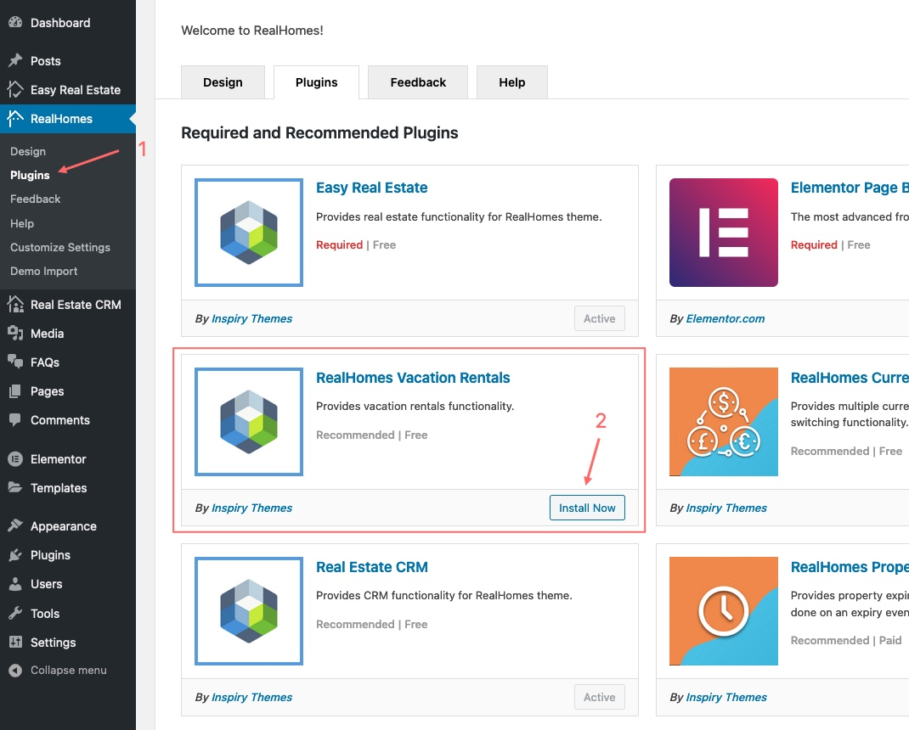

RealHomes Vacation Rentals booking system provides a complete rental solution from booking to reserved dates calendar and dedicated rental specific advance search with many more features.

!!! info "Important Information"

    Vacation Rentals booking system is introduced in RealHomes version {== **3.12.0** ==}. Before you start setting it up, ensure RealHomes theme `version 3.12.0` and all latest required plugins are installed and activated. To set it up please follow the guide given below.

### **Installation**
You would need to install **RealHomes Vacation Rentals** plugin. Go to the **Dashboard > RealHomes > Plugins** and click on the *Install Now* button of the *RealHomes Vacation Rentals* plugin card.

After plugin installation click on the *Activate* button.
