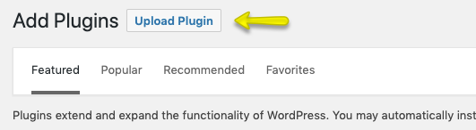
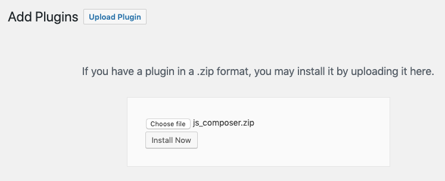
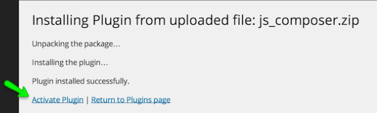
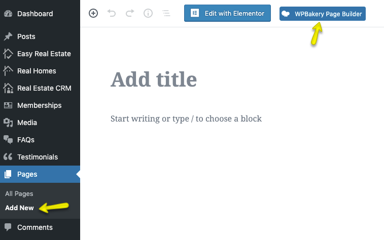
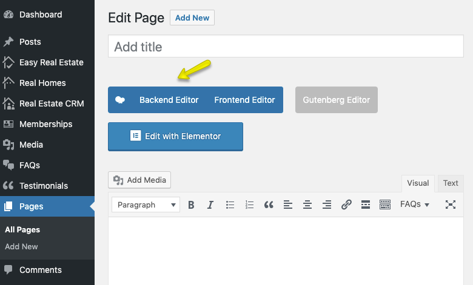
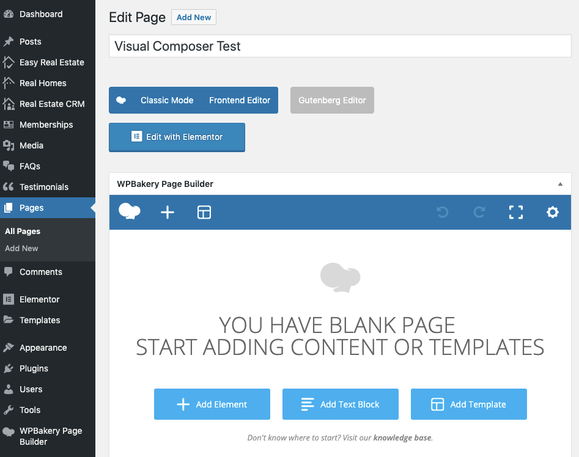
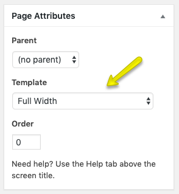
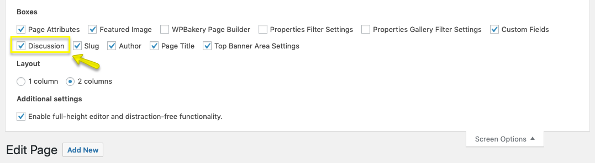
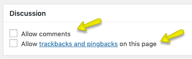

# Visual Composer

### Installation

Look for the folder name **Plugins → Visual Composer** in unzipped package downloaded from themeforest.net. This folder contains visual composer plugin zip named as **js_composer.zip**. You need to go to **Dashboard → Plugins → Add New** in your WordPress admin side and upload the **js_composer.zip** as displayed in the following screenshots.

Once installed, You need to activate the plugin as displayed in screen shot below.

After activation you can create a test page to try out visual composer.

Click on "**Backend Editor**" Button in visual composer toolbar, and you will have the visual composer page builder layout ready for use as displayed in screen shot below.

**Going Full Width**

If you like, You can assign a full width template to the test page.

**Disable Comments**

If you want to disable comments for this page, Then expand the screen options in top right corner and select "**Discussion**" checkbox. It will display discussion meta box below page editor area.

Un-check the both checkboxes in Discussion meta box and publish/update the page.

