### **Vacation Rentals Settings**

You can manage all settings for Vacation Rentals. Follow the navigation path based on your version:

=== "v4.5.1 and Later"

    !!! success "RealHomes Settings"
        Dashboard ➤ RealHomes ➤ Settings ➤ Vacation Rentals

=== "v4.5.0 and Earlier"

    !!! info "Legacy Settings"
        Dashboard ➤ Vacation Rentals ➤ Settings

This section helps you to manage the following features:

- **Enable/Disable Vacation Rentals**
- **Maximum Guests**
- **Booking Type**
    - **Per Day**: Choose between **Full Day** or **Split Day**. Selecting the Split Day option gives more flexibility by not showing reserved dates on the front-end booking form calendar.
    - **Per Hour**: Enables hourly booking functionality for the property.

=== "v4.5.1 and Later"

    !!! success "RealHomes Settings"
        Dashboard ➤ RealHomes ➤ Settings ➤ Vacation Rentals

    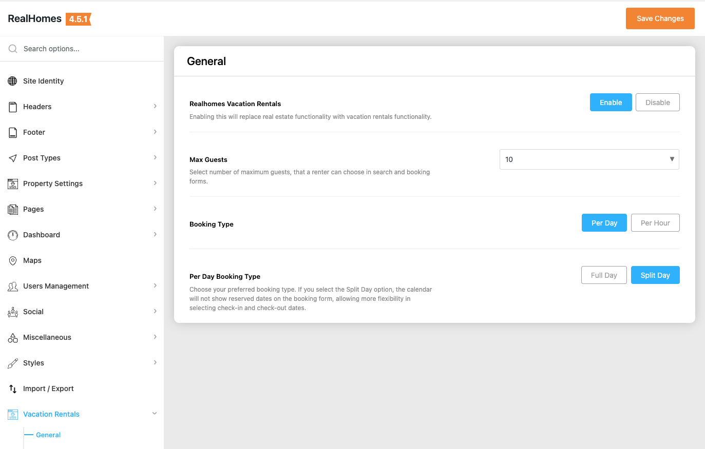

=== "v4.5.0 and Earlier"

    !!! info "Legacy Settings"
        Dashboard ➤ Vacation Rentals ➤ Settings

    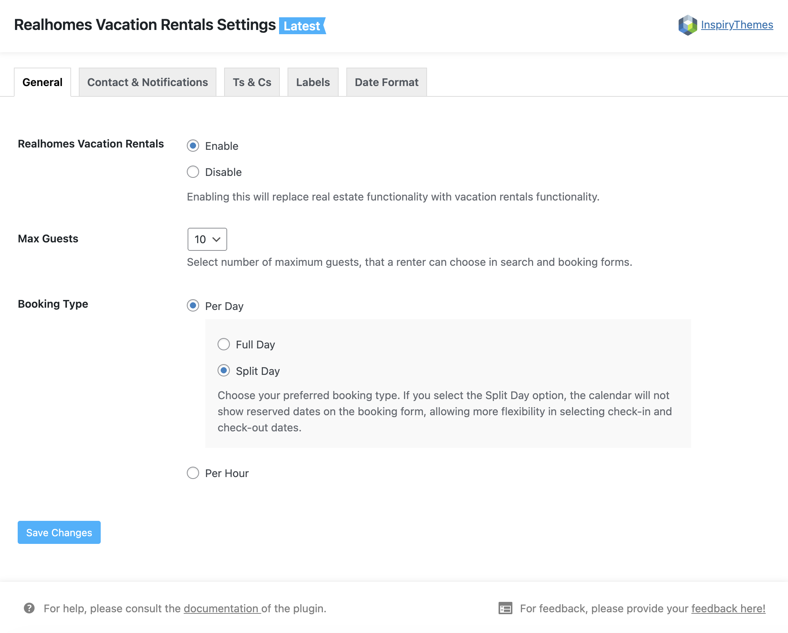

### **Contact & Notifications**

In this section, you can manage:

- **Add/Update Booking Phone Number**
- **Contact Page (optional)**
- **Booking Email**
- **Enable/Disable Booking Request Notification**

!!! info "Important Information"
    If you have enabled **Booking Request Notification for Owner** feature, ensure that all owners in the system have a valid email address.

=== "v4.5.1 and Later"

    !!! success "RealHomes Settings"
        Dashboard ➤ RealHomes ➤ Settings ➤ Vacation Rentals

    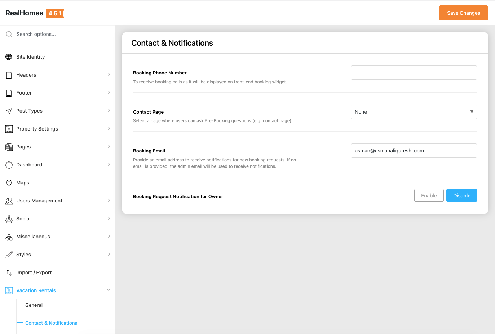

=== "v4.5.0 and Earlier"

    !!! info "Legacy Settings"
        Dashboard ➤ Vacation Rentals ➤ Settings

    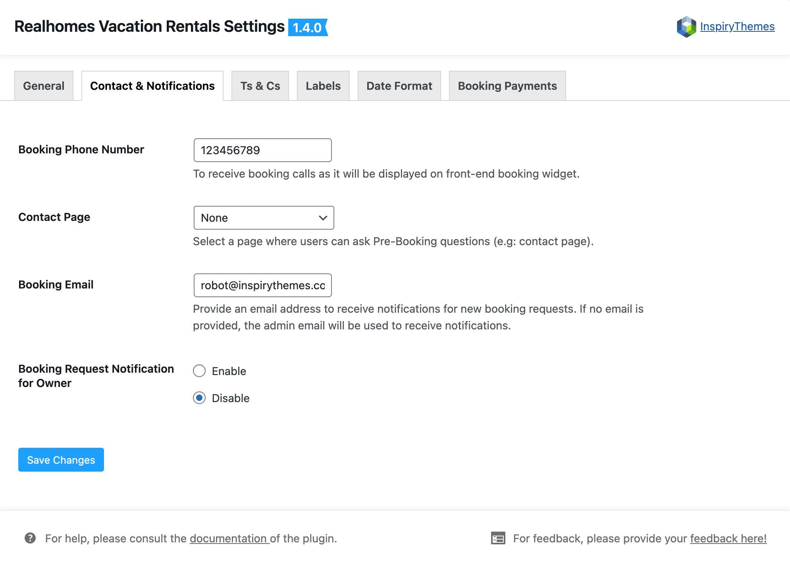

### **Terms and Conditions**

You can manage the **Terms and Conditions** settings in the same section.

=== "v4.5.1 and Later"

    !!! success "RealHomes Settings"
        Dashboard ➤ RealHomes ➤ Settings ➤ Vacation Rentals

    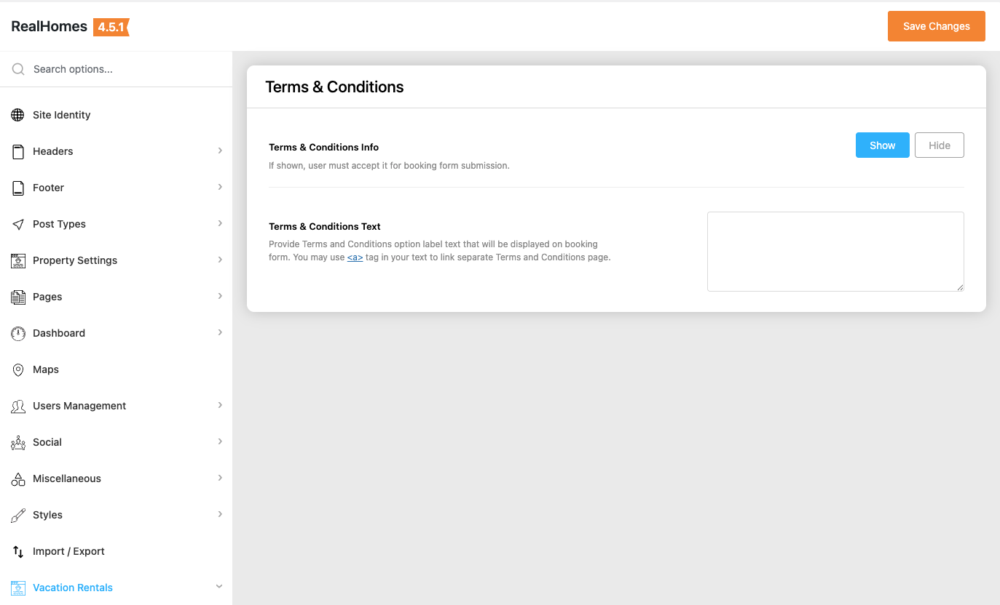

=== "v4.5.0 and Earlier"

    !!! info "Legacy Settings"
        Dashboard ➤ Vacation Rentals ➤ Settings

    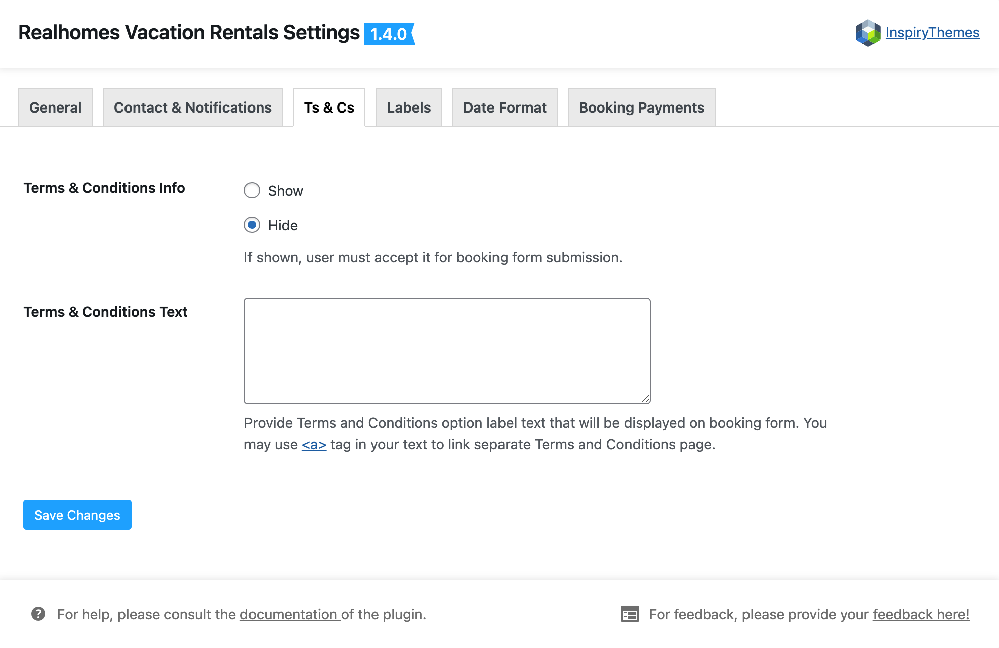

### **Labels**

You can manage the **Labels** for various sections.

=== "v4.5.1 and Later"

    !!! success "RealHomes Settings"
        Dashboard ➤ RealHomes ➤ Settings ➤ Vacation Rentals

    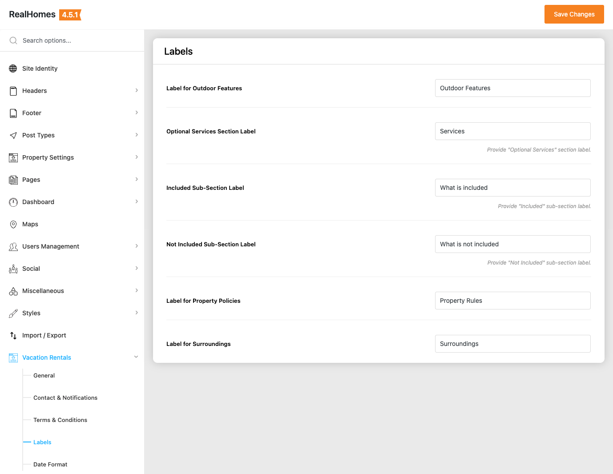

=== "v4.5.0 and Earlier"

    !!! info "Legacy Settings"
        Dashboard ➤ Vacation Rentals ➤ Settings

    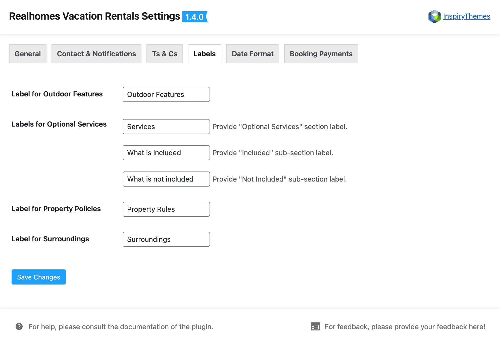

### **Date Format**

You can manage the **Date Format** for Vacation Rentals.

=== "v4.5.1 and Later"

    !!! success "RealHomes Settings"
        Dashboard ➤ RealHomes ➤ Settings ➤ Vacation Rentals

    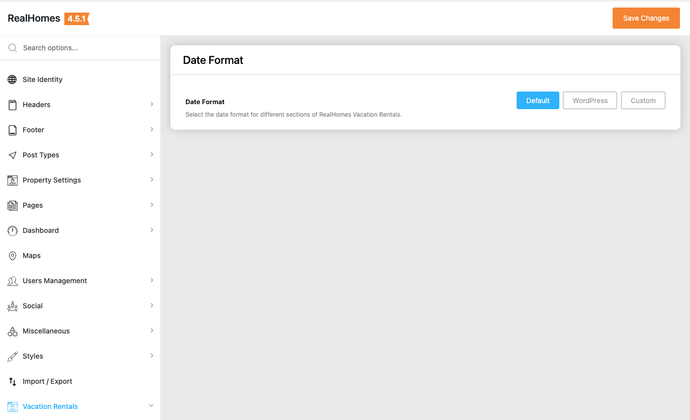

=== "v4.5.0 and Earlier"

    !!! info "Legacy Settings"
        Dashboard ➤ Vacation Rentals ➤ Settings

    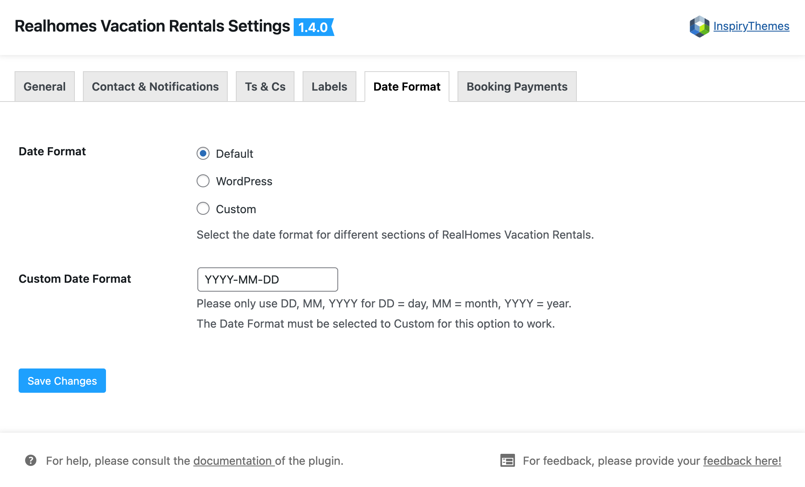

### **Booking Payments**

You can Enable or Disable **Booking Payments**.

=== "v4.5.1 and Later"

    !!! success "RealHomes Settings"
        Dashboard ➤ RealHomes ➤ Settings ➤ Vacation Rentals ➤ Booking Payments

    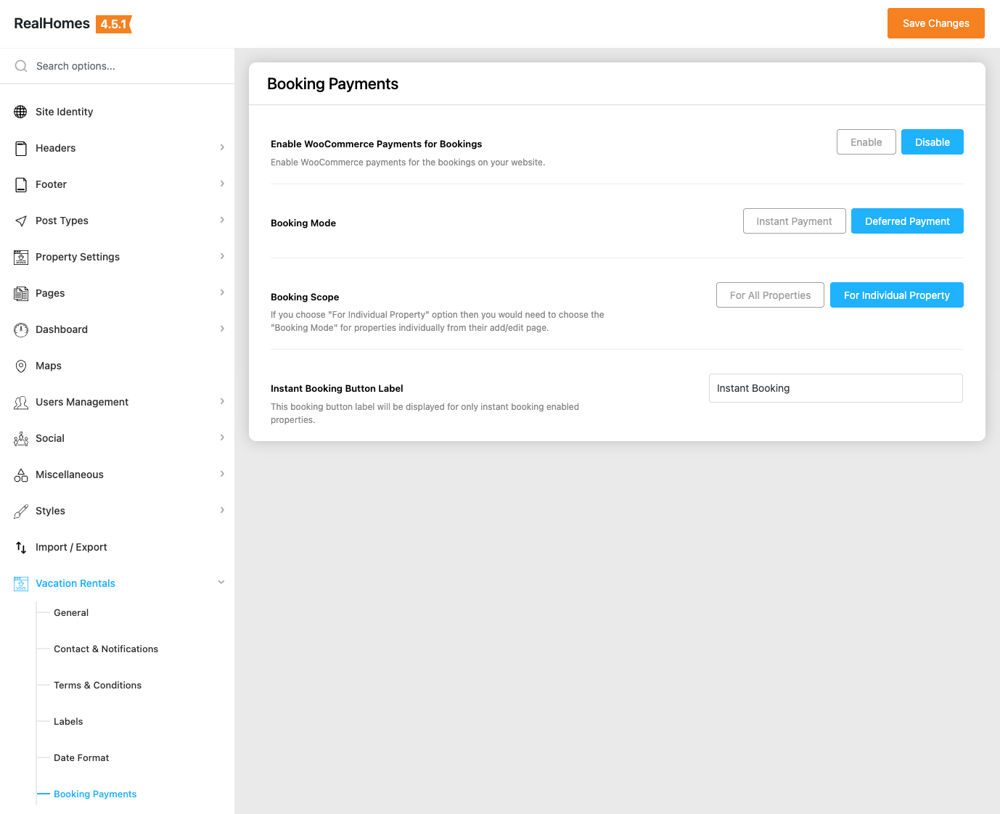

=== "v4.5.0 and Earlier"

    !!! info "Legacy Settings"
        Dashboard ➤ Vacation Rentals ➤ Settings

    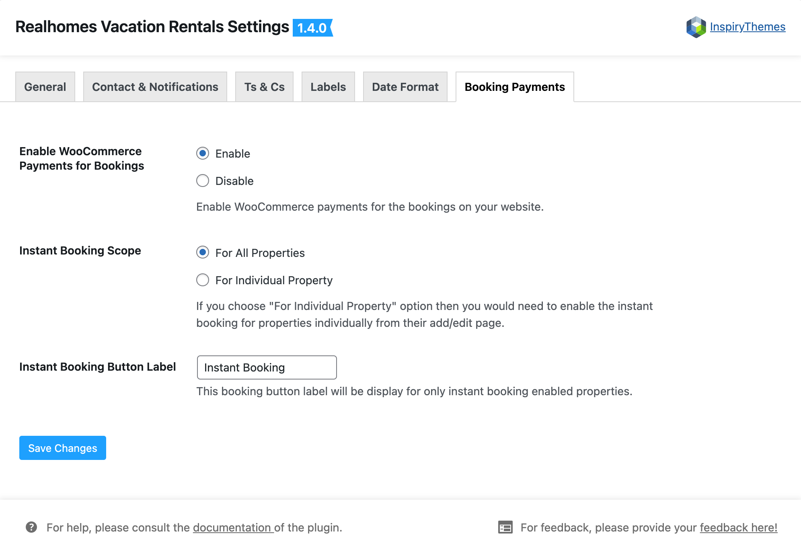