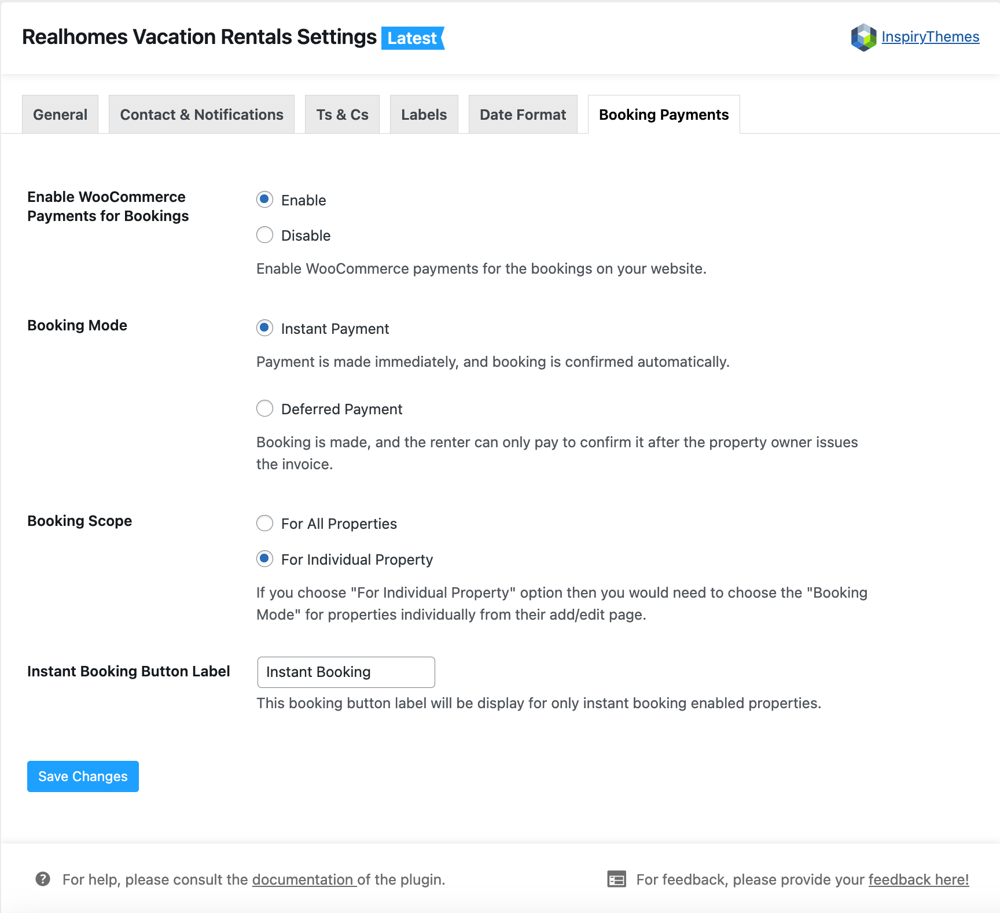

### **Vacation Rentals Settings**

You can make any changes for Vacation Rentals settings in **Dashboard &rarr; Vacation Rentals &rarr; Settings**. This section helps you to manage the following features in this section.

- **Enable/Disable Vacation Rentals**
- **Maximum Guests**
- **Booking Type (Full Day or Split Booking)**

### **Contact & Notifications**

In this section, You can manage the following features in this section.

- **Add/Update Booking Phone Number**
- **Contact Page (optional)**
- **Booking Email**
- **Enable/Disable Booking Request Notification**

!!! info "Important Information"
    If you have enabled **Booking Request Notification for Owner** feature, then ensure that all the owners in the system must have a valid email added for them.

### **Terms and Conditions**

You can manage the **Terms and Conditions** settings here.

### **Labels**

You can manage the **Labels** for various sections.

### **Date Format**

You can manage the **Date Format** for Vacation Rentals.

### **Booking Payments**

You can Enable or Disable the **Booking Payments**.

