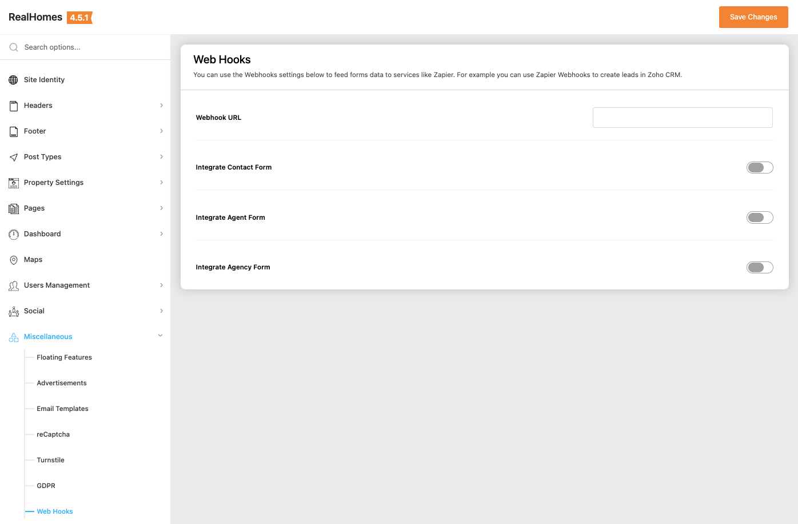

# Setup Webhooks

RealHomes includes **Webhooks** support, allowing you to send lead and property data to external services like **Zapier**, **Zoho CRM**, or other third-party applications automatically.

### **Webhooks Setup Guide**

We have prepared a comprehensive guide on how to integrate RealHomes with external apps using webhooks:

<a class="setup-btn" target="_blank" href="https://inspirythemes.com/setup-webhooks-in-realhomes-theme-to-get-push-notifications-to-your-apps/">WEBHOOKS SETUP GUIDE</a>

---

### **Configuring Webhooks in RealHomes**

To configure webhooks, navigate to the path below based on your RealHomes version:

=== "v4.5.1 and Later"

    !!! success "RealHomes Settings"
        Dashboard ➤ RealHomes ➤ Settings ➤ Miscellaneous ➤ Webhooks (tab)

    

=== "v4.5.0 and Earlier"

    !!! info "Legacy Settings"
        Dashboard ➤ Easy Real Estate ➤ Settings ➤ Webhooks (tab)

1.  Provide the **Webhook URL** received from your external service provider.
2.  Enable the specific triggers (e.g., Lead Submission, Property Submission) you want to send data for.
3.  Click **Save Changes**.