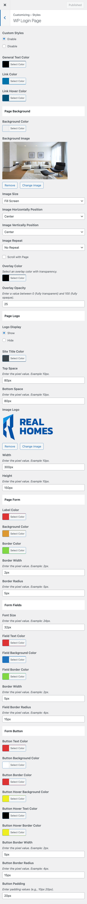

# Customize WordPress Login Page Styles

RealHomes allows you to personalize the WordPress login page to better match your brand and design preferences.

To access these options:

1. Navigate to **Dashboard → RealHomes → Customize Settings**.
2. Select **Styles → WP Login Page**.

You can choose to **enable or disable** the custom login styles provided by the theme. Once enabled, you'll be able to modify various style elements such as colors, background, logo, and form appearance—ensuring a cohesive and branded login experience.

📝 **Tip:**  
After customizing the login page, preview it in an incognito browser window to see how it appears to users.

