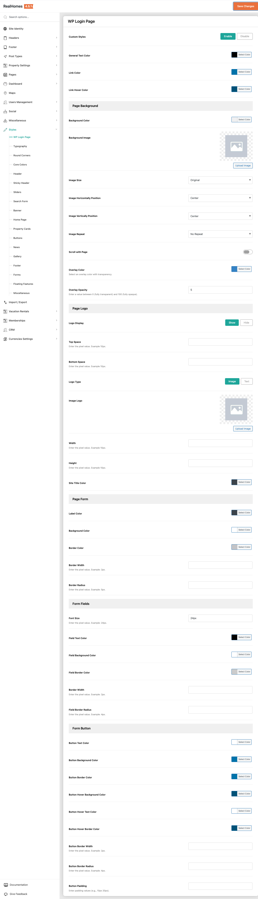
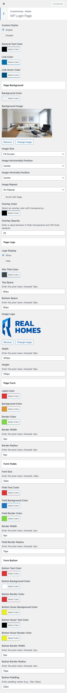

# Customize WordPress Login Page Styles

RealHomes allows you to personalize the WordPress login page to better match your brand and design preferences.

To access these options, follow the navigation path based on your version of the **RealHomes** theme:

=== "v4.5.1 and Later"

    !!! success "RealHomes Settings"
        Dashboard ➤ RealHomes ➤ Settings ➤ Styles ➤ WP Login Page

    You can choose to **enable or disable** the custom login styles provided by the theme. Once enabled, you'll be able to modify various style elements such as colors, background, logo, and form appearance—ensuring a cohesive and branded login experience.

    📝 **Tip:**  
    After customizing the login page, preview it in an incognito browser window to see how it appears to users.

    

=== "v4.5.0 and Earlier"

    !!! info "Legacy Settings"
        Dashboard ➤ RealHomes ➤ Customize Settings ➤ Styles ➤ WP Login Page

    You can choose to **enable or disable** the custom login styles provided by the theme. Once enabled, you'll be able to modify various style elements such as colors, background, logo, and form appearance—ensuring a cohesive and branded login experience.

    📝 **Tip:**  
    After customizing the login page, preview it in an incognito browser window to see how it appears to users.

    