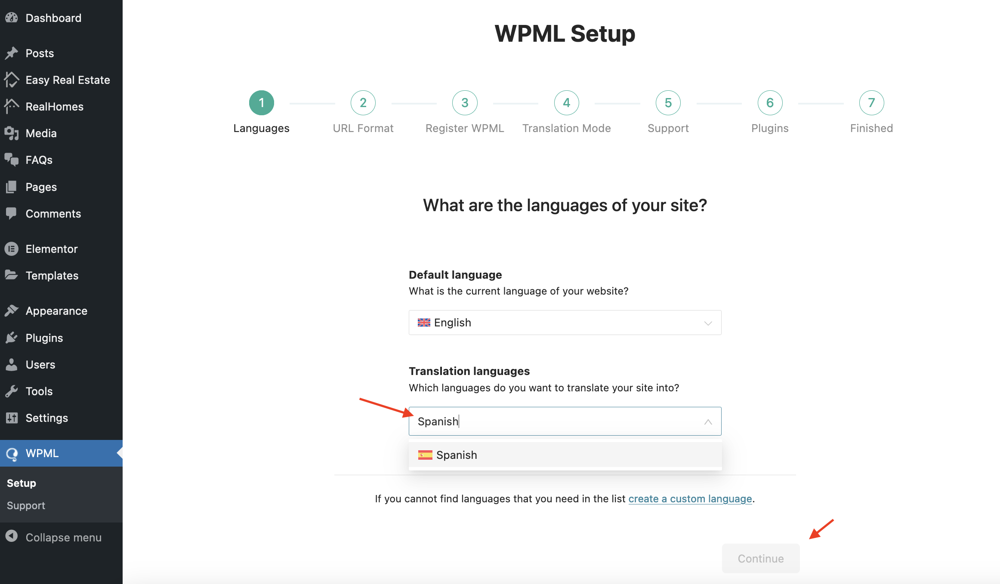
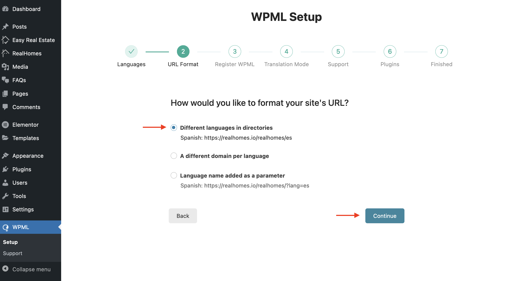
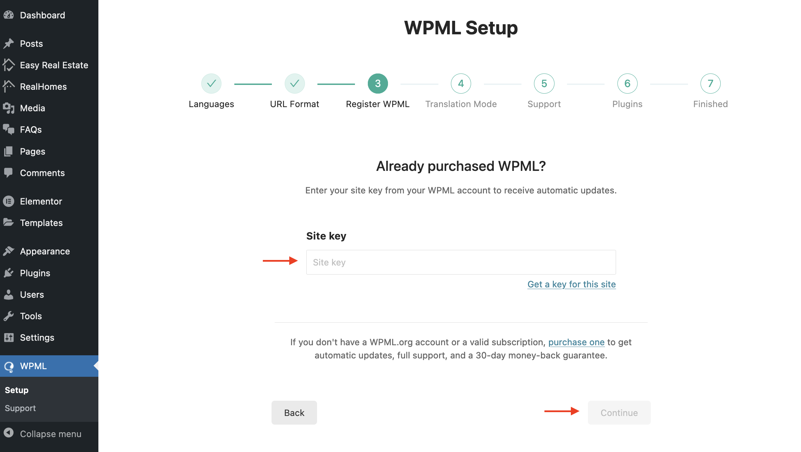
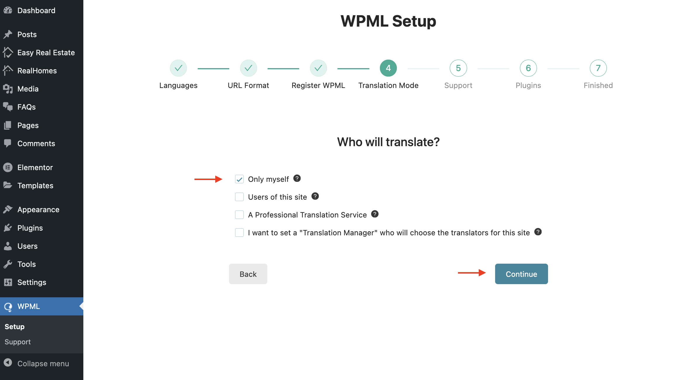
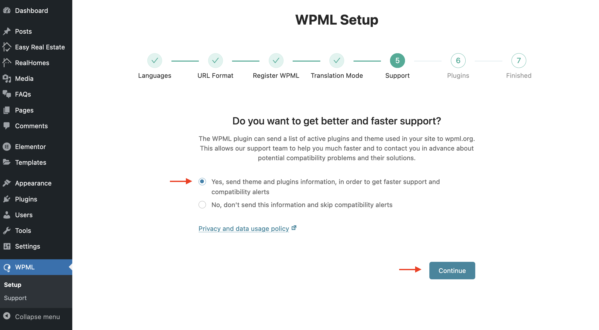
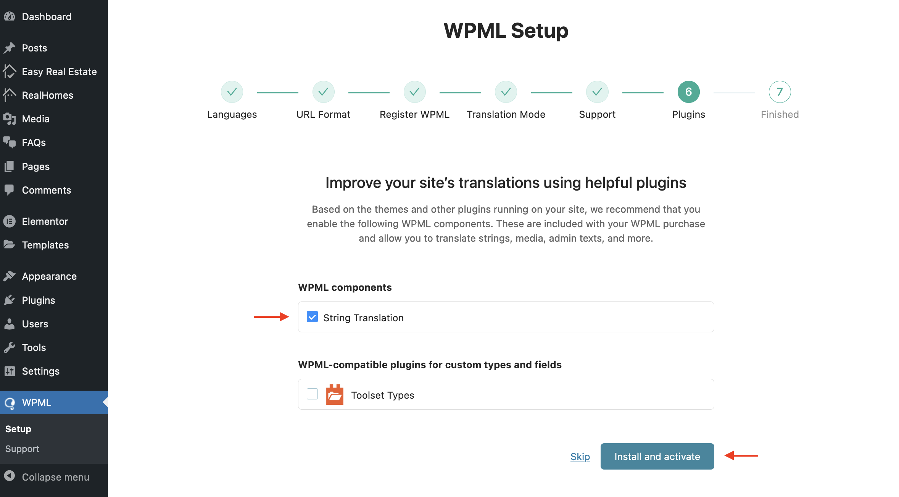
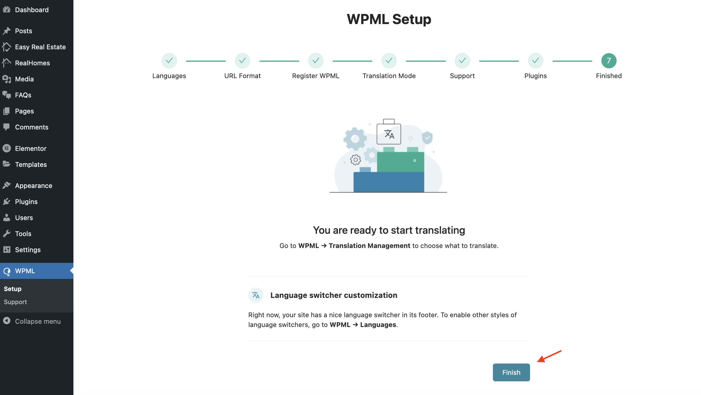
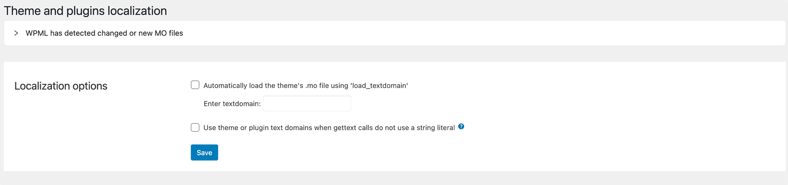

# WPML Basic Setup

> Before proceeding, make sure you have purchased the **WPML Multilingual CMS package** and have a working version of WordPress with the RealHomes Theme installed and configured based on the provided documentation and sample data within the theme package.

Please follow the steps below to configure the basic settings for the WPML Plugin.

## Installation & Activation

Install and activate the **WPML Multilingual CMS Plugin**.

## Initial Setup

Upon activation, you will see a notice at the top to configure WPML if this is your first time activating it. Click on **Configure WPML**.

## Languages Setup

Next, add the languages of your choice that you want to use for your website's translation.

## Configure Site's URL

On the next step, select "**Different languages in directories**" to configure the **site's URL** for multilingual content.

## Verify WPML License

In order to verify the license of WPML and receive regular plugin updates, please add the Site Key provided by WPML.

## Translators Settings

Configure the settings about who will be translating the content. Select "Only myself" if you plan to add all the translations manually.

## Share Usage Data with WPML

The next step allows you to choose whether you want to share data with WPML officials for future support and improvements.

## Install String Translation Plugin

The 6th step in the onboarding process is crucial. Select "String Translation" to install the string translation plugin, as it enables the String Translation feature of WPML.

## Finish the Onboarding Process

Click "Finish" to complete the onboarding process and the initial setup of the WPML Translation plugin.

## Make Themes Work Multilingual

Search for **Make themes work multilingual** and disable this option.

## Theme & Plugin Localization

Go to **Dashboard → WPML → Theme and Plugin Localization**. Under **Localization options**, choose **Automatically load the theme's .mo file using 'load_textdomain'**, and type **framework** in the **Enter textdomain** field below, then click **Save**.

## Scan the Theme and Plugins

Navigate to the **Strings in the Theme** section, press the **Scan the theme for Strings** button, and wait for the results.

## Track Strings Appearance

Go to **Dashboard → WPML → String Translation** section and configure the following settings.

## Disable WPML Advance (side-by-side) Translation Editor

In **Dashboard → WPML → Settings**, scroll down until you find "**How to translate posts and pages**" and set it to **Use WPML's Classic Translation Editor** as shown below.

## Start Translating the Strings

With the basic settings complete, you can now translate any string that does not exist in the posts, pages, and taxonomies via the **Dashboard → WPML → String Translation** section. For more information, consult the [WPML String Translation Documentation](https://wpml.org/documentation/getting-started-guide/string-translation/).

## WPML Language Switcher Settings

Once the basic setup is complete, you can proceed to set up the **[WPML Language Switcher](https://realhomes.io/documentation/wpml-language-switcher/)**.

By following these steps, you'll have the WPML Plugin configured and ready to manage multilingual content on your RealHomes WordPress theme website.