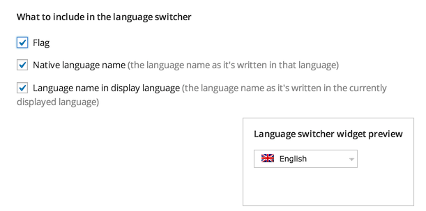
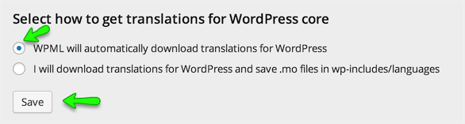
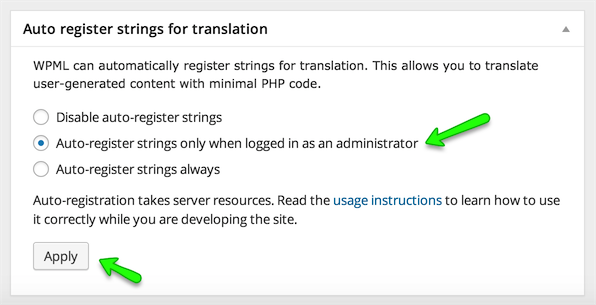
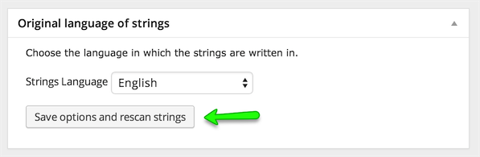

# WPML Basic Setup

> I am assuming that you have a working version of WordPress with Real Homes theme installed and configured based on the documenation and sample data provided with in the theme package.

Please follow the steps below to configure the basic settings for WPML Plugin.

1. Install and Activate **WPML Multilingual CMS Plugin**.

2. Go to **Dashboard → WPML → Languages**.

3. Select **English** as **Current Language** and Go Next.

4. Select the other languages for your site and **Go Next**.

5. Leave all the section on this page as it is and Go Next.

6. Register WPML if you want to receive automatic updates OR press "**Remind Me Later**" button.

7. Click Finish Button, Now you will be taken to **Dashboard → WPML → Languages** page but with different interface. If not then manually go to **Dashboard → WPML → Languages Page**.

8. Look for **Language URL Format** section and choose the url format that suites your needs. I am choosing the 1st one with languages directories at the end. **Save** the changes. 

9. Look for **Language Switcher Options** section and then look for What to include in the language switcher option. Choose to display **Flag with in language switcher** and save the changes. Leave all other options as it is. 

10. Leave all other sections as it is.

11. Now, Install and activate **WPML String Translation plugin**. 

12. After that Go to **Dashboard → WPML → Theme and Plugin Localization**.

13. 1st Option is “**Select how to localize the theme**”, Choose **Translate by WPML** and **Save**. 

14. Next Option is “**Select how to get translations for WordPress**”, Choose the 1st options “**WPML will automatically download translations for WordPress**” and save. 

15. Skip the Option “**Language locale Settings**”.

16. Next Options is “**Strings in the Theme**”, Press the **Scan the theme for Strings** Button and Wait for results. 

17. Now, Go to **Dashboard → WPML → String Translation** section and configure the following settings. 

18. Basic settings are complete and you can translate a string that do not exist in post, pages and taxonomies using **WPML → String Translation** Section for more information https://wpml.org/documentation/getting-started-guide/string-translation/
