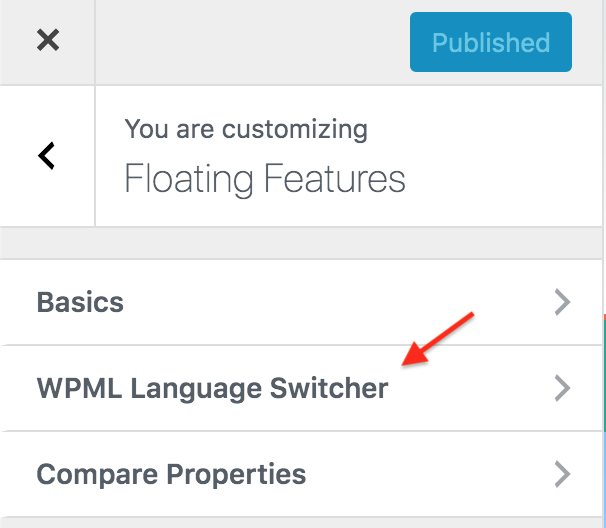
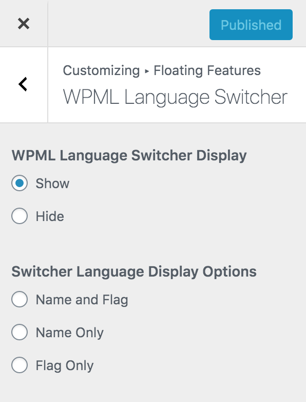
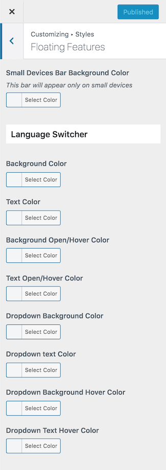

# WPML Language Switcher Setup

### Configure WPML Language Switcher

Navigate to **Dashboard → Real Homes → Customize Settings → Floating Features** and look for **WPML Language Switcher** panel.

You can find all the settings of WPML Language Switcher of RealHomes theme in this panel.

### WPML Language Switcher Styles

Go to **Dashboard → Real Homes → Customize Settings → Styles → Floating Features** to modify the colors of **WPML Language Switcher**.

