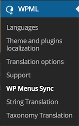
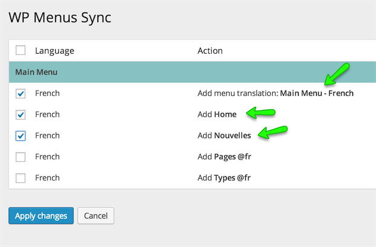

# WPML Menus Sync

1. To setup language specific menus, Go to **Dashboard → WPML → WPML Menus Sync**

2. Click the **Sync** button.

3. Select the pages that you have translated + the Main Menu translation to other language. Press **Apply Changes** and wait for the menus to be synced. 

4. Once syncing is complete, Visit the home page in other language and you will see that translated menu will appear in place of english menu. 

