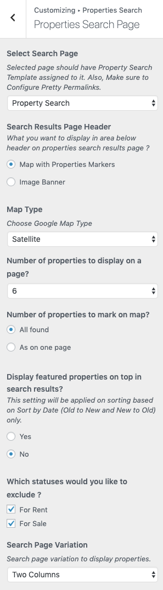

# Translating Property Search Page

Before setting up **Property Search page** please make sure that the **Language URL Format** should be set to **Different languages in directories** (as displayed in the screenshot below). 

1. Go to **Dashboard → Pages** in WordPress admin side and look for **Property Search Page**. Click on the + button to add it's translation. 

2. Provide the translated page title. 

3. Make sure the language meta box is showing the right settings. 

4. Make sure it is using the **Property Search Template**. 

5. **Publish** the page once ready.

6. **Note:** For English Property Search page we have already configured the URL in appropriate settings section. Now, We need to translate that URL value so that search form on our other language pass the parameters to translated search page. 

**Classic**

**Modern**

7. **Property Search page** is translated and ready to be used.
