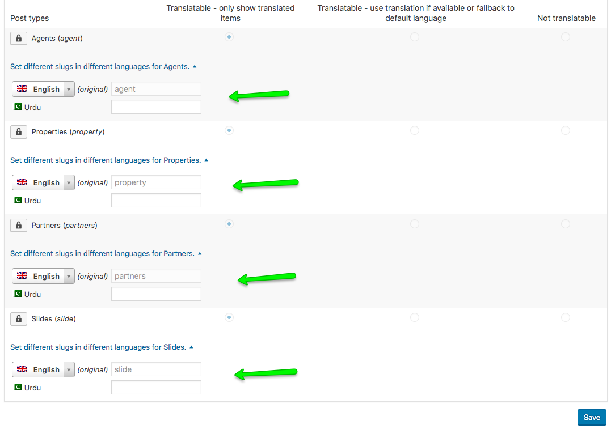
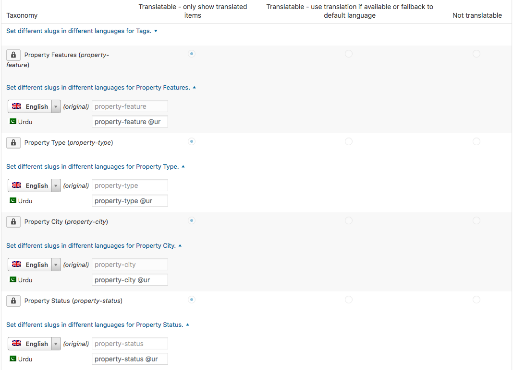

# Slugs Translation

### **Important Instructions**

Please note that you have to refresh the **Permalinks** settings after making changes to the slugs or anything related to the slugs. To refresh the permalink structure, simply navigate to **Dashboard → Settings → Permalinks** and save it once.

### **Custom Post Type Slug Translation**

To translate the slugs of **Property**, **Partners** and other **Custom Post Types** navigate to **Dashboard → WPML → Settings** section and scroll down to find **Post Types Translation** section.

### **Taxonomy Slug Translation**

You can also translate slugs of any Taxonomy as well as Category in this very section.

